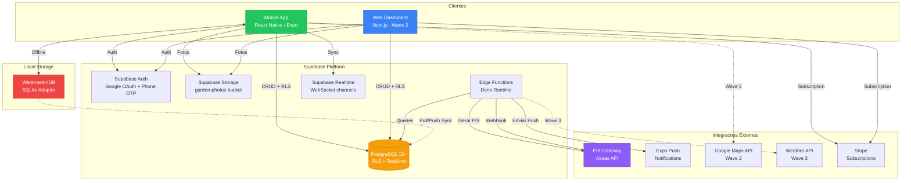
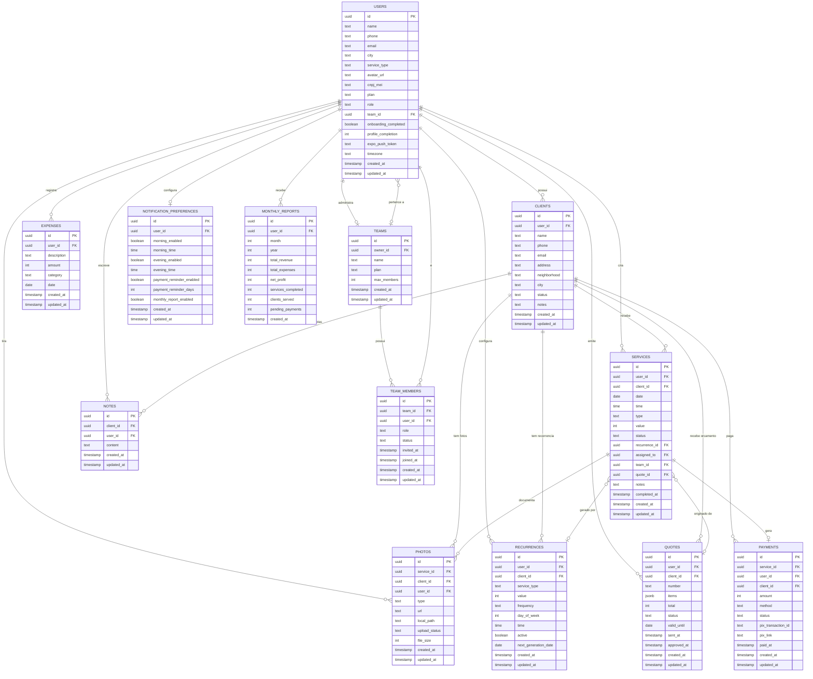
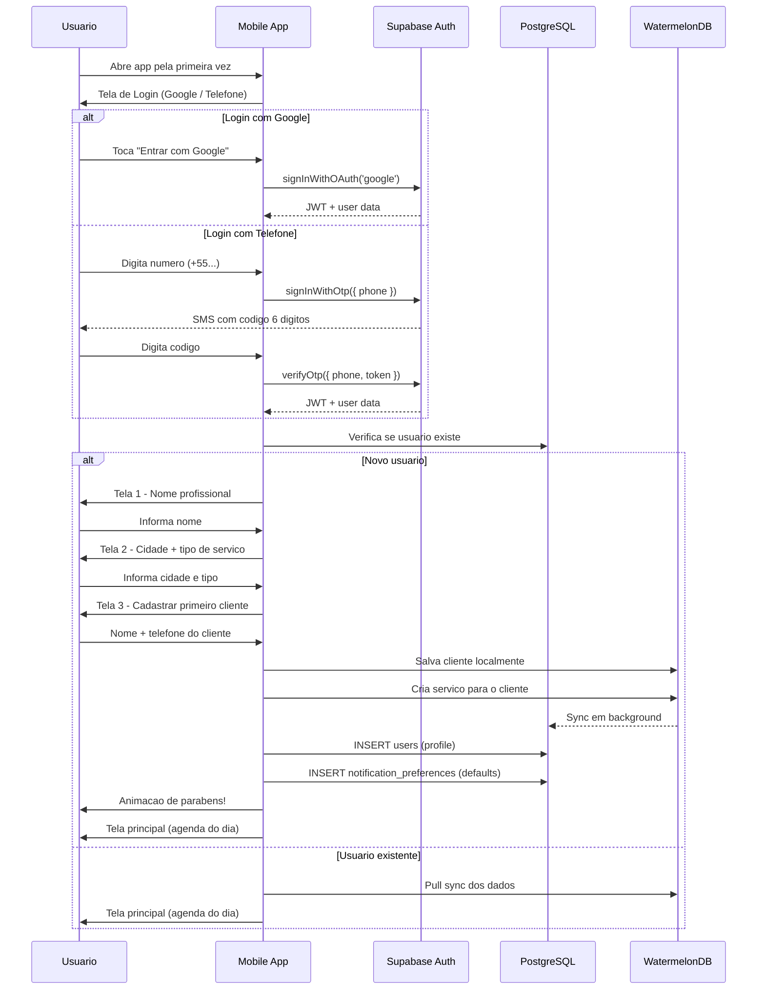
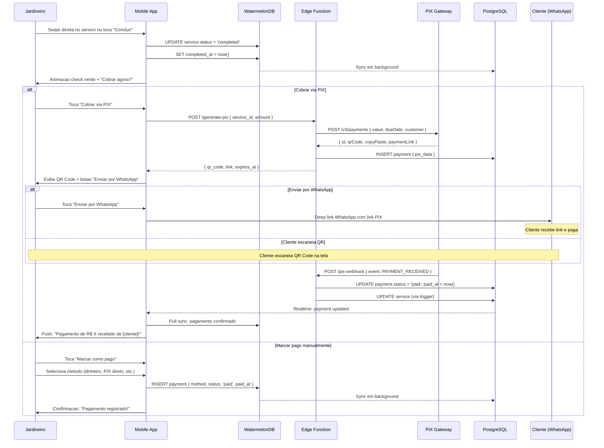
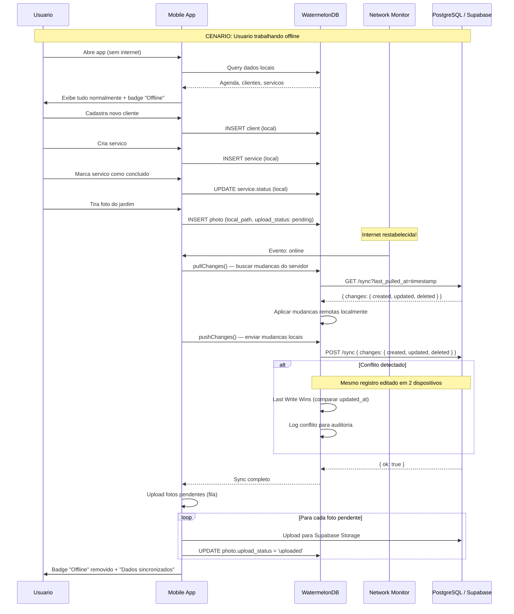
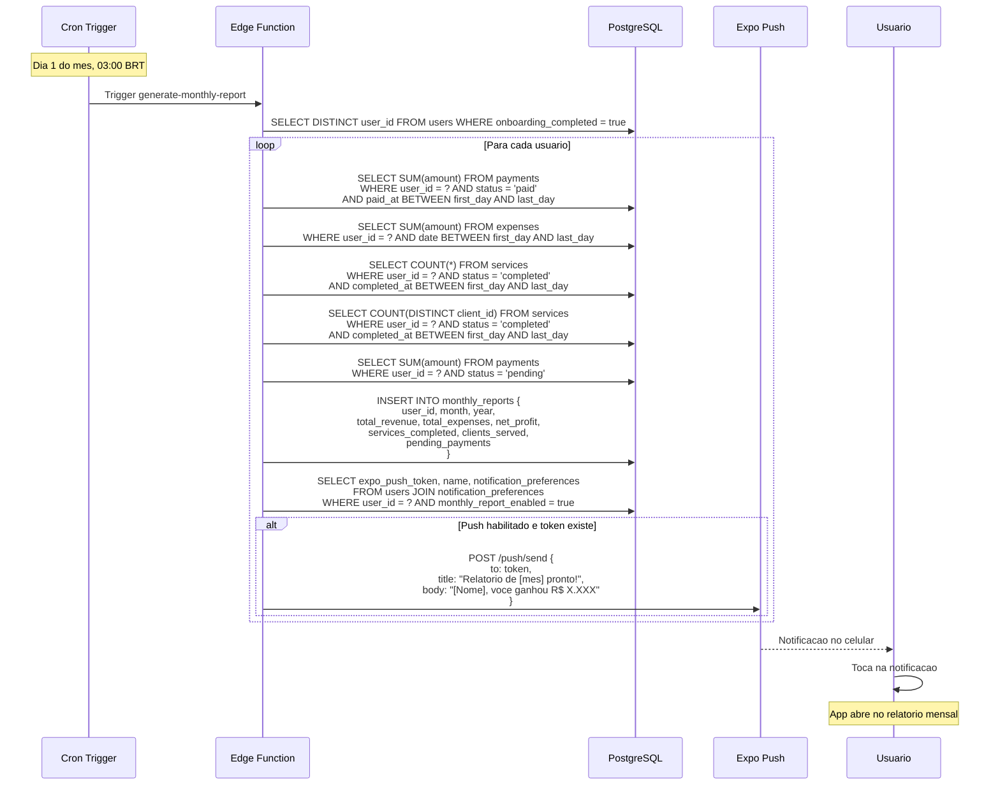
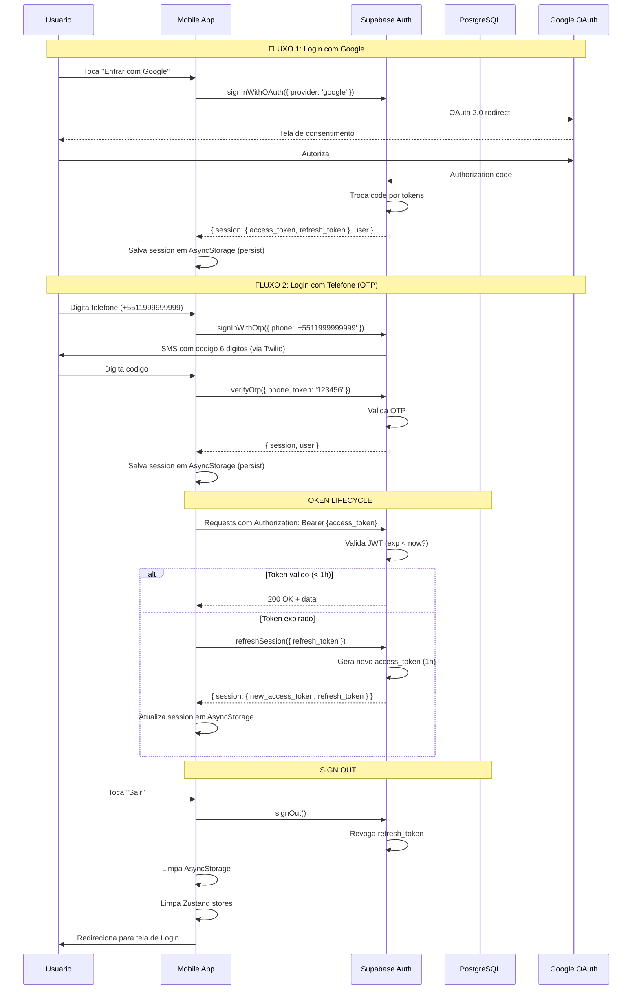
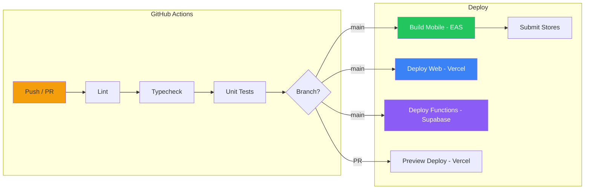

# Arquitetura Fullstack — GardenGreen

> **Documento:** Architecture
> **Versao:** 1.1.0
> **Autor:** @architect (Aria)
> **Data:** 2026-03-17
> **Status:** Review
> **Baseado em:** PRD v0.1.0 (score 8.4/10), Tech Stack, Ecosystem Architecture

### Change Log

| Data | Versao | Descricao | Autor |
|------|--------|-----------|-------|
| 2026-03-17 | 1.0.0 | Documento inicial — arquitetura fullstack completa | @architect (Aria) |
| 2026-03-17 | 1.1.0 | Gap fill: Changelog, Auth flow diagram, Sync adapter detalhado, Stripe webhook Edge Function, Checklist validation | @architect (Aria) |

---

## 1. Introducao

### 1.1 Visao Geral do Projeto

GardenGreen e uma plataforma SaaS mobile-first de gestao completa para jardineiros profissionais brasileiros. O produto transforma o caos operacional do jardineiro autonomo — que hoje gerencia clientes, agenda, orcamentos e financas por WhatsApp e caderninho — em uma operacao profissional e lucrativa.

O mercado enderecavel inclui aproximadamente 285.000 profissionais de jardinagem no Brasil, com TAM de R$133M/ano. Nao existe nenhuma solucao SaaS brasileira verticalizada para esse publico. Os concorrentes globais (Jobber US$39/mes, Housecall Pro US$69/mes) nao operam no Brasil, nao suportam PIX, e custam 4-5x mais.

### 1.2 Objetivos da Arquitetura

| Objetivo | Descricao | Metrica |
|----------|-----------|---------|
| **Mobile-First** | Toda experiencia projetada para uso no campo (sol, luvas, pressa) | App < 30MB, touch targets 48dp+ |
| **Offline-First** | App funciona 100% sem internet para operacoes core | Sync success > 99%, zero perda de dados |
| **Ultra-Simples** | Interface para publico low-tech (WhatsApp e limite digital) | Onboarding < 2 min, tarefas core em 3 toques |
| **Solo-First** | Otimizado para jardineiro autonomo, equipe como upgrade | Solo R$29-49/mes, Equipe R$99-199/mes |
| **Custo Zero Inicial** | Bootstrapped, free tiers de todas as plataformas | Supabase Free → Pro ($25/mes) quando MRR > R$500 |

### 1.3 Starter Template

N/A — Projeto greenfield com Turborepo monorepo, sem uso de templates pre-existentes.

---

## 2. Arquitetura de Alto Nivel

### 2.1 Resumo Tecnico

GardenGreen e uma aplicacao fullstack baseada em Supabase como BaaS (Backend as a Service), com um app mobile cross-platform em React Native/Expo como interface principal e um web dashboard em Next.js para administracao (Wave 2). O monorepo Turborepo compartilha types, validacao Zod e utilitarios entre mobile e web. A camada offline utiliza WatermelonDB com SQLite para garantir funcionamento completo sem internet, com sync bidirecional para Supabase via protocolo pull/push. Pagamentos PIX sao processados via gateway brasileiro (Asaas) atraves de Edge Functions Deno no Supabase, e notificacoes push sao gerenciadas pelo Expo Push Notifications com cron jobs em Edge Functions.

### 2.2 Plataforma

| Camada | Tecnologia | Papel |
|--------|-----------|-------|
| **Mobile App** | React Native / Expo (SDK 51+) | Interface principal, offline-first |
| **Web Dashboard** | Next.js 14+ (App Router) | Admin, relatorios (Wave 2) |
| **Backend** | Supabase (PostgreSQL 15+) | Auth, DB, Storage, Edge Functions, Realtime |
| **Hosting Web** | Vercel | Deploy automatico, edge, previews |
| **Hosting Mobile** | EAS (Expo Application Services) | Builds, submits, OTA updates |
| **Monorepo** | Turborepo | Build caching, shared packages |

### 2.3 Repositorio

Turborepo monorepo com estrutura:
- `apps/mobile` — React Native / Expo
- `apps/web` — Next.js (Wave 2)
- `packages/shared` — Types, Zod schemas, constants, utils
- `packages/ui` — Componentes compartilhados
- `packages/config` — ESLint, TypeScript, Jest configs
- `supabase/` — Migrations, Edge Functions, seed data

### 2.4 Diagrama de Arquitetura



### 2.5 Padroes Arquiteturais

| # | Padrao | Aplicacao | Justificativa |
|---|--------|-----------|---------------|
| 1 | **Offline-First** | WatermelonDB como source of truth local | Jardineiro trabalha em jardim sem Wi-Fi; operacoes core devem funcionar 100% offline |
| 2 | **BaaS (Backend as a Service)** | Supabase gerencia auth, DB, storage, functions | Zero backend custom = menos custo, menos manutencao, mais velocidade de entrega |
| 3 | **Component-Based UI** | React Native components + NativeWind | Reutilizacao de componentes, design system consistente mobile/web |
| 4 | **Repository Pattern** | Supabase client + React Query hooks | Abstrai acesso a dados, facilita troca de fonte (local vs remoto) |
| 5 | **Event-Driven** | Supabase Realtime + Webhooks PIX | Sync entre dispositivos e confirmacao de pagamento em tempo real |
| 6 | **Multi-Tenant via RLS** | PostgreSQL Row Level Security | Isolamento de dados no nivel do banco, zero trust no frontend |
| 7 | **Monorepo** | Turborepo com shared packages | Uma fonte de verdade para types e validacao; build caching para DX rapida |
| 8 | **CQRS Simplificado** | Zustand (UI state) + React Query (server state) | Separacao clara de estado local vs remoto; optimistic updates |
| 9 | **Edge Computing** | Supabase Edge Functions (Deno) | Logica de negocio proximo ao banco, latencia minima |
| 10 | **Progressive Enhancement** | Perfil progressivo, features desbloqueadas gradualmente | Onboarding minimo, valor entregue desde o primeiro uso |

---

## 3. Tech Stack

### 3.1 Tabela Completa

| Categoria | Tecnologia | Versao | Proposito | Justificativa |
|-----------|-----------|--------|-----------|---------------|
| **Linguagem** | TypeScript | 5.3+ | Linguagem principal (mobile, web, shared) | Type safety, DX, ecosystem |
| **Mobile Framework** | React Native | 0.73+ | App cross-platform (Android + iOS) | Ecosystem maduro, performance nativa |
| **Mobile Platform** | Expo SDK | 51+ | Managed workflow, OTA updates | Simplifica builds, push, camera |
| **Mobile Navigation** | Expo Router | 3.x | File-based routing, deep linking | Consistencia com Next.js, simples |
| **Mobile Styling** | NativeWind | 4.x | Tailwind CSS para React Native | Design system unificado mobile/web |
| **Web Framework** | Next.js | 14+ | Web dashboard (Wave 2) | App Router, SSR, Server Components |
| **Web UI** | shadcn/ui | latest | Componentes acessiveis | Customizavel, sem lock-in, Tailwind |
| **Web Styling** | Tailwind CSS | 3.4+ | Utility-first CSS | Consistencia com NativeWind |
| **State (UI)** | Zustand | 4.x | Estado local da UI | Leve (~1KB), persist middleware, simples |
| **State (Server)** | TanStack React Query | 5.x | Cache, optimistic updates, sync | Background refetch, stale-while-revalidate |
| **Forms** | React Hook Form | 7.x | Formularios performaticos | Uncontrolled inputs, minimo re-render |
| **Validacao** | Zod | 3.x | Schema validation (frontend + backend) | Type inference, composable, runtime safe |
| **Offline DB** | WatermelonDB | 0.27+ | Database local com sync | SQLite, lazy loading, observables |
| **Backend** | Supabase | latest | BaaS completo | PostgreSQL + Auth + Storage + Functions + Realtime |
| **Database** | PostgreSQL | 15+ | Banco relacional principal | RLS nativo, JSONB, full-text search |
| **Auth** | Supabase Auth | latest | Autenticacao | Google OAuth + Phone OTP, JWT |
| **Storage** | Supabase Storage | latest | Armazenamento de arquivos | Fotos de jardins, PDFs de orcamentos |
| **Edge Functions** | Supabase Edge Functions | latest | Logica serverless | Deno runtime, deploy global |
| **Realtime** | Supabase Realtime | latest | WebSocket channels | Sync entre dispositivos, team updates |
| **Testing Unit** | Jest | 29+ | Testes unitarios | Standard, mocking, coverage |
| **Testing Component** | React Native Testing Library | 12+ | Testes de componente | User-centric testing |
| **Testing E2E** | Detox | 20+ | Testes end-to-end mobile | Testes em devices reais |
| **Monorepo** | Turborepo | 1.x | Build system | Caching, task orchestration |
| **Mobile Build** | EAS Build | latest | CI/CD mobile | Builds na nuvem, submissions |
| **Web Deploy** | Vercel | latest | Hosting web | Auto deploys, edge, previews |
| **CI/CD** | GitHub Actions | latest | Pipeline automatizado | Lint, typecheck, test, deploy |
| **Analytics** | PostHog | latest | Product analytics | Funnels, feature flags, session replay |
| **Error Tracking** | Sentry | latest | Crash reports | Mobile + web + edge functions |
| **Payments (Subscription)** | Stripe | latest | Cobranca de planos | Recorrencia, portal do cliente |
| **Payments (PIX)** | Asaas | latest | Gateway PIX brasileiro | QR code, link, webhook, taxas competitivas |
| **Push Notifications** | Expo Push | latest | Notificacoes mobile | Integrado com Expo, setup simples |
| **Email** | Resend | latest | Emails transacionais | API simples, templates, deliverability |
| **Charts** | Recharts | 2.x | Graficos no dashboard | Simples, React-native-compatible via web view |
| **Camera** | expo-camera + expo-image-picker | latest | Captura de fotos | Camera nativa, galeria, compressao |
| **Image Processing** | expo-image-manipulator | latest | Compressao de imagens | Resize, compress, max 1MB |

---

## 4. Modelos de Dados

### 4.1 Interfaces TypeScript

```typescript
// packages/shared/src/types/database.ts

// ============================================
// ENUMS
// ============================================

export type ServiceStatus = 'scheduled' | 'in_progress' | 'completed' | 'cancelled';
export type PaymentStatus = 'pending' | 'paid' | 'refunded' | 'overdue';
export type PaymentMethod = 'pix_app' | 'pix_direct' | 'cash' | 'transfer' | 'other';
export type QuoteStatus = 'draft' | 'sent' | 'approved' | 'rejected' | 'expired';
export type RecurrenceFrequency = 'weekly' | 'biweekly' | 'monthly';
export type PhotoType = 'before' | 'after';
export type UploadStatus = 'pending' | 'uploading' | 'uploaded' | 'failed';
export type TeamMemberRole = 'admin' | 'member';
export type TeamMemberStatus = 'invited' | 'active' | 'inactive';
export type ClientStatus = 'active' | 'inactive';
export type ExpenseCategory = 'fuel' | 'tools' | 'supplies' | 'maintenance' | 'other';
export type UserPlan = 'free' | 'solo' | 'team';
export type UserRole = 'gardener' | 'admin' | 'member';

// ============================================
// ENTIDADES
// ============================================

export interface User {
  id: string;                          // UUID, FK auth.users
  name: string;                        // Nome profissional
  phone: string | null;                // Telefone (+55...)
  email: string | null;                // Email (do Google ou manual)
  city: string | null;                 // Cidade de atuacao
  service_type: string | null;         // Tipo de servico principal
  avatar_url: string | null;           // URL da foto de perfil
  cnpj_mei: string | null;            // CNPJ/MEI opcional
  address: string | null;              // Endereco comercial
  plan: UserPlan;                      // Plano atual
  role: UserRole;                      // Papel no sistema
  team_id: string | null;             // FK teams.id (se membro de equipe)
  onboarding_completed: boolean;       // Se completou onboarding
  profile_completion: number;          // 0-100 porcentagem
  expo_push_token: string | null;      // Token para push notifications
  timezone: string;                    // Timezone do usuario (default: America/Sao_Paulo)
  created_at: string;                  // ISO timestamp
  updated_at: string;                  // ISO timestamp
}

export interface Client {
  id: string;                          // UUID
  user_id: string;                     // FK users.id (dono do registro)
  name: string;                        // Nome do cliente
  phone: string;                       // Telefone do cliente
  email: string | null;                // Email opcional
  address: string | null;              // Endereco completo
  neighborhood: string | null;         // Bairro (para busca)
  city: string | null;                 // Cidade
  latitude: number | null;             // Geocoding (Wave 2)
  longitude: number | null;            // Geocoding (Wave 2)
  notes: string | null;                // Notas rapidas
  status: ClientStatus;                // Ativo/Inativo
  created_at: string;
  updated_at: string;
}

export interface Service {
  id: string;                          // UUID
  user_id: string;                     // FK users.id (dono)
  client_id: string;                   // FK clients.id
  date: string;                        // Data do servico (YYYY-MM-DD)
  time: string | null;                 // Horario estimado (HH:mm)
  type: string;                        // Tipo de servico (poda, manutencao, plantio, etc.)
  description: string | null;          // Descricao adicional
  value: number;                       // Valor cobrado em centavos (R$)
  status: ServiceStatus;               // Status atual
  recurrence_id: string | null;        // FK recurrences.id (se recorrente)
  assigned_to: string | null;          // FK users.id (membro da equipe)
  team_id: string | null;              // FK teams.id
  quote_id: string | null;             // FK quotes.id (se veio de orcamento)
  notes: string | null;                // Notas do servico
  completed_at: string | null;         // Quando foi concluido
  cancelled_at: string | null;         // Quando foi cancelado
  created_at: string;
  updated_at: string;
}

export interface Recurrence {
  id: string;                          // UUID
  user_id: string;                     // FK users.id
  client_id: string;                   // FK clients.id
  service_type: string;                // Tipo de servico template
  value: number;                       // Valor em centavos
  frequency: RecurrenceFrequency;      // Semanal, quinzenal, mensal
  day_of_week: number;                 // 0-6 (domingo-sabado)
  time: string | null;                 // Horario padrao (HH:mm)
  active: boolean;                     // Se esta gerando servicos
  next_generation_date: string;        // Proxima data para gerar instancias
  created_at: string;
  updated_at: string;
}

export interface Quote {
  id: string;                          // UUID
  user_id: string;                     // FK users.id
  client_id: string;                   // FK clients.id
  number: string;                      // Numero sequencial (ORC-001)
  items: QuoteItem[];                  // Itens do orcamento (JSONB)
  total: number;                       // Total em centavos
  status: QuoteStatus;                 // Status atual
  valid_until: string;                 // Data de validade
  sent_at: string | null;             // Quando foi enviado
  approved_at: string | null;         // Quando foi aprovado
  notes: string | null;               // Observacoes
  created_at: string;
  updated_at: string;
}

export interface QuoteItem {
  description: string;                 // Descricao do servico
  value: number;                       // Valor em centavos
  quantity: number;                    // Quantidade (default: 1)
}

export interface Payment {
  id: string;                          // UUID
  service_id: string;                  // FK services.id
  user_id: string;                     // FK users.id
  client_id: string;                   // FK clients.id
  amount: number;                      // Valor em centavos
  method: PaymentMethod;               // Metodo de pagamento
  status: PaymentStatus;               // Status do pagamento
  pix_transaction_id: string | null;   // ID da transacao no gateway
  pix_qr_code: string | null;         // QR code PIX (base64)
  pix_copy_paste: string | null;      // Codigo copia-e-cola
  pix_link: string | null;            // Link de pagamento
  pix_expires_at: string | null;      // Expiracao do PIX
  paid_at: string | null;             // Quando foi pago
  refunded_at: string | null;         // Quando foi estornado
  created_at: string;
  updated_at: string;
}

export interface Expense {
  id: string;                          // UUID
  user_id: string;                     // FK users.id
  description: string;                 // Descricao da despesa
  amount: number;                      // Valor em centavos
  category: ExpenseCategory;           // Categoria
  date: string;                        // Data da despesa (YYYY-MM-DD)
  created_at: string;
  updated_at: string;
}

export interface Photo {
  id: string;                          // UUID
  service_id: string;                  // FK services.id
  client_id: string;                   // FK clients.id
  user_id: string;                     // FK users.id
  type: PhotoType;                     // Antes ou depois
  url: string | null;                  // URL no Supabase Storage (apos upload)
  local_path: string | null;           // Path local no device
  upload_status: UploadStatus;         // Status do upload
  file_size: number;                   // Tamanho em bytes
  width: number;                       // Largura em pixels
  height: number;                      // Altura em pixels
  created_at: string;
  updated_at: string;
}

export interface Note {
  id: string;                          // UUID
  client_id: string;                   // FK clients.id
  user_id: string;                     // FK users.id
  content: string;                     // Texto da nota
  created_at: string;
  updated_at: string;
}

export interface Team {
  id: string;                          // UUID
  owner_id: string;                    // FK users.id (administrador)
  name: string;                        // Nome da empresa/equipe
  plan: UserPlan;                      // Plano da equipe
  max_members: number;                 // Limite de membros (baseado no plano)
  created_at: string;
  updated_at: string;
}

export interface TeamMember {
  id: string;                          // UUID
  team_id: string;                     // FK teams.id
  user_id: string;                     // FK users.id
  role: TeamMemberRole;                // Admin ou membro
  status: TeamMemberStatus;            // Convidado, ativo, inativo
  invited_at: string;                  // Quando foi convidado
  joined_at: string | null;           // Quando aceitou
  created_at: string;
  updated_at: string;
}

export interface NotificationPreference {
  id: string;                          // UUID
  user_id: string;                     // FK users.id (unique)
  morning_enabled: boolean;            // Push matinal habilitado
  morning_time: string;                // Horario matinal (HH:mm, default: "06:00")
  evening_enabled: boolean;            // Push vespera habilitado
  evening_time: string;                // Horario vespera (HH:mm, default: "20:00")
  payment_reminder_enabled: boolean;   // Lembrete de cobranca
  payment_reminder_days: number;       // Dias para lembrete (default: 3)
  monthly_report_enabled: boolean;     // Relatorio mensal
  created_at: string;
  updated_at: string;
}

export interface MonthlyReport {
  id: string;                          // UUID
  user_id: string;                     // FK users.id
  month: number;                       // Mes (1-12)
  year: number;                        // Ano
  total_revenue: number;               // Receita total em centavos
  total_expenses: number;              // Despesas totais em centavos
  net_profit: number;                  // Lucro liquido em centavos
  services_completed: number;          // Servicos realizados
  clients_served: number;              // Clientes atendidos
  pending_payments: number;            // Total pendente em centavos
  pending_count: number;               // Quantidade de pagamentos pendentes
  created_at: string;
}
```

### 4.2 Diagrama ER



---

## 5. Especificacao de API (Supabase)

GardenGreen **nao** utiliza API REST custom. Todo acesso a dados e feito via Supabase Client SDK com RLS (Row Level Security) para autorizacao. Logica de negocio complexa reside em Edge Functions.

### 5.1 Politicas RLS (Row Level Security)

```sql
-- ============================================
-- PRINCIPIO: Cada usuario so ve/edita seus proprios dados.
-- Membros de equipe veem dados da equipe conforme permissoes.
-- ============================================

-- CLIENTS: usuario ve apenas seus clientes
-- Admin de equipe ve clientes de todos os membros
CREATE POLICY "clients_select_own" ON clients FOR SELECT
  USING (user_id = auth.uid());

CREATE POLICY "clients_insert_own" ON clients FOR INSERT
  WITH CHECK (user_id = auth.uid());

CREATE POLICY "clients_update_own" ON clients FOR UPDATE
  USING (user_id = auth.uid());

CREATE POLICY "clients_delete_own" ON clients FOR DELETE
  USING (user_id = auth.uid());

-- SERVICES: usuario ve seus servicos + servicos atribuidos a ele
CREATE POLICY "services_select_own_or_assigned" ON services FOR SELECT
  USING (
    user_id = auth.uid()
    OR assigned_to = auth.uid()
    OR team_id IN (
      SELECT team_id FROM team_members
      WHERE user_id = auth.uid() AND role = 'admin' AND status = 'active'
    )
  );

CREATE POLICY "services_insert_own" ON services FOR INSERT
  WITH CHECK (user_id = auth.uid());

CREATE POLICY "services_update_own_or_admin" ON services FOR UPDATE
  USING (
    user_id = auth.uid()
    OR team_id IN (
      SELECT team_id FROM team_members
      WHERE user_id = auth.uid() AND role = 'admin' AND status = 'active'
    )
  );

-- PAYMENTS: usuario ve apenas seus pagamentos
CREATE POLICY "payments_select_own" ON payments FOR SELECT
  USING (user_id = auth.uid());

CREATE POLICY "payments_insert_own" ON payments FOR INSERT
  WITH CHECK (user_id = auth.uid());

CREATE POLICY "payments_update_own" ON payments FOR UPDATE
  USING (user_id = auth.uid());

-- QUOTES: usuario ve apenas seus orcamentos
CREATE POLICY "quotes_select_own" ON quotes FOR SELECT
  USING (user_id = auth.uid());

CREATE POLICY "quotes_insert_own" ON quotes FOR INSERT
  WITH CHECK (user_id = auth.uid());

CREATE POLICY "quotes_update_own" ON quotes FOR UPDATE
  USING (user_id = auth.uid());

-- EXPENSES: usuario ve apenas suas despesas
CREATE POLICY "expenses_select_own" ON expenses FOR SELECT
  USING (user_id = auth.uid());

CREATE POLICY "expenses_insert_own" ON expenses FOR INSERT
  WITH CHECK (user_id = auth.uid());

-- PHOTOS: usuario ve fotos dos seus clientes
CREATE POLICY "photos_select_own" ON photos FOR SELECT
  USING (user_id = auth.uid());

CREATE POLICY "photos_insert_own" ON photos FOR INSERT
  WITH CHECK (user_id = auth.uid());

-- NOTES: usuario ve notas dos seus clientes
CREATE POLICY "notes_select_own" ON notes FOR SELECT
  USING (user_id = auth.uid());

CREATE POLICY "notes_insert_own" ON notes FOR INSERT
  WITH CHECK (user_id = auth.uid());

-- TEAMS: admin ve sua equipe
CREATE POLICY "teams_select_member" ON teams FOR SELECT
  USING (
    owner_id = auth.uid()
    OR id IN (SELECT team_id FROM team_members WHERE user_id = auth.uid())
  );

-- TEAM_MEMBERS: admin ve membros, membro ve a si mesmo
CREATE POLICY "team_members_select" ON team_members FOR SELECT
  USING (
    user_id = auth.uid()
    OR team_id IN (SELECT team_id FROM team_members WHERE user_id = auth.uid())
  );

-- NOTIFICATION_PREFERENCES: usuario ve apenas suas preferencias
CREATE POLICY "notif_prefs_select_own" ON notification_preferences FOR SELECT
  USING (user_id = auth.uid());

CREATE POLICY "notif_prefs_update_own" ON notification_preferences FOR UPDATE
  USING (user_id = auth.uid());

-- MONTHLY_REPORTS: usuario ve apenas seus relatorios
CREATE POLICY "reports_select_own" ON monthly_reports FOR SELECT
  USING (user_id = auth.uid());

-- RECURRENCES: usuario ve apenas suas recorrencias
CREATE POLICY "recurrences_select_own" ON recurrences FOR SELECT
  USING (user_id = auth.uid());

CREATE POLICY "recurrences_insert_own" ON recurrences FOR INSERT
  WITH CHECK (user_id = auth.uid());

CREATE POLICY "recurrences_update_own" ON recurrences FOR UPDATE
  USING (user_id = auth.uid());
```

### 5.2 Edge Functions

| Funcao | Trigger | Descricao | Input | Output |
|--------|---------|-----------|-------|--------|
| `generate-pix` | HTTP POST | Gera cobranca PIX via Asaas | `{ service_id, amount }` | `{ qr_code, copy_paste, link, expires_at }` |
| `pix-webhook` | HTTP POST (webhook) | Recebe confirmacao de pagamento do Asaas | Webhook payload | 200 OK |
| `send-push-morning` | Cron (05:30 BRT) | Envia push matinal "Seus clientes de hoje" | - | `{ sent: number }` |
| `send-push-evening` | Cron (19:30 BRT) | Envia push vespera "Seus clientes de amanha" | - | `{ sent: number }` |
| `send-push-payment-reminder` | Cron (10:00 BRT) | Lembrete de cobracas pendentes | - | `{ sent: number }` |
| `generate-monthly-report` | Cron (dia 1, 03:00 BRT) | Gera relatorio mensal para todos os usuarios | - | `{ reports: number }` |
| `expire-quotes` | Cron (00:00 BRT) | Expira orcamentos vencidos | - | `{ expired: number }` |
| `generate-recurrence-instances` | Cron (00:30 BRT) | Gera instancias de servicos recorrentes | - | `{ generated: number }` |
| `health-check` | HTTP GET | Health check do sistema | - | `{ status: 'ok', timestamp }` |
| `stripe-webhook` | HTTP POST (webhook) | Recebe eventos de subscription do Stripe | Webhook payload | 200 OK |
| `sync-pull` | HTTP POST | Pull de mudancas para sync offline | `{ last_pulled_at, tables }` | `{ changes, timestamp }` |
| `sync-push` | HTTP POST | Push de mudancas locais para servidor | `{ changes, last_pulled_at }` | `{ ok: true }` |

### 5.3 Realtime Subscriptions

| Canal | Tabela | Evento | Uso |
|-------|--------|--------|-----|
| `services:{user_id}` | services | INSERT, UPDATE | Sync de agenda entre dispositivos |
| `services:team:{team_id}` | services | INSERT, UPDATE | Sync de equipe (admin ve tudo) |
| `payments:{user_id}` | payments | UPDATE | Confirmacao de pagamento PIX em tempo real |
| `clients:{user_id}` | clients | INSERT, UPDATE | Sync de clientes entre dispositivos |

### 5.4 Storage Buckets

| Bucket | Acesso | Limite por Arquivo | Tipos Permitidos | Uso |
|--------|--------|-------------------|------------------|-----|
| `garden-photos` | Autenticado (RLS) | 1 MB | image/jpeg, image/png, image/webp | Fotos antes/depois de jardins |
| `avatars` | Autenticado (RLS) | 500 KB | image/jpeg, image/png | Foto de perfil do usuario |
| `report-images` | Autenticado (RLS) | 2 MB | image/png | Imagens de relatorios para compartilhar |

---

## 6. Componentes

### 6.1 Mobile App (React Native / Expo)

**Telas principais:**

| Tela | Tab | Descricao | Prioridade |
|------|-----|-----------|------------|
| Hoje (Agenda Dia) | Agenda | Lista de servicos do dia, swipe para concluir | P0 |
| Agenda Semana | Agenda | Visao semanal com badges por dia | P0 |
| Novo Servico | Agenda | Formulario de agendamento | P0 |
| Lista de Clientes | Clientes | Busca e filtro, listagem alfabetica | P0 |
| Ficha do Cliente | Clientes | Dados, historico, notas, fotos | P0 |
| Novo Cliente | Clientes | Formulario rapido (nome + telefone) | P0 |
| Lista de Orcamentos | Orcamentos | Orcamentos com filtro por status | P0 |
| Novo Orcamento | Orcamentos | Formulario com itens e total | P0 |
| Dashboard Financeiro | Financeiro | "Quanto ganhei", receitas vs despesas | P0 |
| Nova Despesa | Financeiro | Formulario rapido de despesa | P1 |
| Relatorio Mensal | Financeiro | Relatorio detalhado com graficos | P0 |
| Cobrar PIX | - | QR code + enviar por WhatsApp | P0 |
| Pagamentos Pendentes | Financeiro | Lista de cobracas em aberto | P1 |
| Perfil | Mais | Dados do usuario, progresso | P1 |
| Configuracoes | Mais | Notificacoes, conta, sobre | P2 |
| Minha Equipe | Mais | Lista de membros, convite | P2 |
| Login | Auth | Google + Telefone | P0 |
| Onboarding (3 telas) | Auth | Nome, cidade, primeiro cliente | P0 |

**Navegacao:** Tab-based (bottom tabs)

| Tab | Icone | Tela Principal |
|-----|-------|---------------|
| Agenda | calendar | Hoje (agenda do dia) |
| Clientes | users | Lista de clientes |
| Orcamentos | file-text | Lista de orcamentos |
| Financeiro | dollar-sign | Dashboard de ganhos |
| Mais | menu | Perfil, config, equipe |

### 6.2 Web Dashboard (Next.js) — Wave 2

| Pagina | Rota | Descricao |
|--------|------|-----------|
| Dashboard | `/` | Visao geral: agenda, metricas, alertas |
| Agenda | `/agenda` | Calendario mensal com drag-and-drop |
| Clientes | `/clientes` | Tabela com busca, filtro, paginacao |
| Orcamentos | `/orcamentos` | Lista com status, acoes em batch |
| Financeiro | `/financeiro` | Graficos detalhados, exportacao CSV |
| Relatorios | `/relatorios` | Historico de relatorios mensais |
| Equipe | `/equipe` | Gestao de membros, atribuicoes |
| Configuracoes | `/configuracoes` | Conta, plano, notificacoes |

### 6.3 Shared Package

```typescript
// packages/shared/
//   src/
//     types/          → database.ts, api.ts
//     schemas/        → clientSchema.ts, serviceSchema.ts, quoteSchema.ts, ...
//     constants/      → serviceTypes.ts, expenseCategories.ts, plans.ts
//     utils/          → formatCurrency.ts, formatPhone.ts, dateHelpers.ts
//     validation/     → index.ts (re-exports all Zod schemas)
```

Exemplo de schema Zod compartilhado:

```typescript
// packages/shared/src/schemas/clientSchema.ts
import { z } from 'zod';

export const createClientSchema = z.object({
  name: z.string().min(2, 'Nome deve ter pelo menos 2 caracteres').max(100),
  phone: z.string()
    .regex(/^\+55\d{10,11}$/, 'Telefone invalido. Use formato +55DDD...')
    .transform(v => v.replace(/\D/g, '')),
  email: z.string().email('Email invalido').nullable().optional(),
  address: z.string().max(200).nullable().optional(),
  neighborhood: z.string().max(100).nullable().optional(),
  city: z.string().max(100).nullable().optional(),
  notes: z.string().max(500).nullable().optional(),
});

export const updateClientSchema = createClientSchema.partial();

export type CreateClientInput = z.infer<typeof createClientSchema>;
export type UpdateClientInput = z.infer<typeof updateClientSchema>;
```

### 6.4 Supabase Backend

- **Database:** PostgreSQL 15+ com RLS em todas as tabelas
- **Auth:** Google OAuth + Phone OTP, JWT com refresh
- **Storage:** Buckets `garden-photos`, `avatars`, `report-images`
- **Edge Functions:** 9 funcoes (PIX, push, relatorio, cron jobs)
- **Realtime:** Canais por `user_id` e `team_id`

### 6.5 Push Service

Expo Push Notifications via Edge Functions com cron jobs:
- **Matinal (05:30 BRT):** Query servicos do dia, envio batch
- **Vespera (19:30 BRT):** Query servicos de amanha, envio batch
- **Cobranca (10:00 BRT):** Query servicos pendentes > N dias
- **Relatorio (dia 1, apos geracao):** Trigger apos `generate-monthly-report`

### 6.6 Payment Service

Integracao PIX via Asaas API:
- **Gerar cobranca:** Edge Function `generate-pix` cria cobranca na Asaas
- **QR Code:** Retornado pela API, exibido no app
- **Link de pagamento:** Enviavel por WhatsApp
- **Confirmacao:** Webhook da Asaas chama `pix-webhook`, atualiza `payments` e `services`
- **Expiracao:** PIX expira em 24h, fallback para marcacao manual

---

## 7. APIs Externas

### 7.1 Supabase (BaaS)

| Servico | Uso | Free Tier Limits |
|---------|-----|-----------------|
| Auth | Google OAuth, Phone OTP, session management | 50,000 MAUs |
| Database | PostgreSQL 15+, RLS, triggers | 500 MB |
| Storage | Fotos, avatars, report images | 1 GB |
| Edge Functions | PIX, push, relatorios, crons | 500K invocations/mes |
| Realtime | Sync entre dispositivos, team updates | 200 concurrent connections |

### 7.2 PIX Gateway (Asaas)

| Endpoint | Metodo | Uso |
|----------|--------|-----|
| `POST /v3/payments` | Criar | Gerar cobranca PIX com QR code |
| `GET /v3/payments/{id}` | Consultar | Verificar status de pagamento |
| `DELETE /v3/payments/{id}` | Cancelar | Cancelar cobranca pendente |
| `POST /webhook` | Receber | Webhook de confirmacao de pagamento |

**Taxas Asaas PIX:** R$0,99 por cobranca PIX gerada. Sem mensalidade.

**Webhook events:**
- `PAYMENT_RECEIVED` — PIX pago pelo cliente
- `PAYMENT_OVERDUE` — PIX expirado
- `PAYMENT_DELETED` — PIX cancelado

### 7.3 Stripe (Subscriptions)

| Uso | Detalhes |
|-----|----------|
| Plano Solo | R$29-49/mes, cobranca recorrente |
| Plano Equipe | R$99-199/mes, cobranca recorrente |
| Customer Portal | Self-service para upgrade/downgrade/cancelar |
| Webhooks | `invoice.paid`, `customer.subscription.updated`, `customer.subscription.deleted` |

### 7.4 Expo Push Notifications

| Uso | Detalhes |
|-----|----------|
| Push Token | Obtido no app via `Notifications.getExpoPushTokenAsync()` |
| Envio | POST `https://exp.host/--/api/v2/push/send` |
| Batch | Ate 100 notificacoes por request |
| Receipts | Verificacao de entrega em batch |

### 7.5 Google Maps API (Wave 2)

| Servico | Uso |
|---------|-----|
| Geocoding | Converter endereco de cliente em lat/lng |
| Distance Matrix | Calcular distancia entre clientes |
| Directions | Otimizacao de rotas (Wave 3) |

### 7.6 Weather API (Wave 3)

| Servico | Uso |
|---------|-----|
| Previsao 3 dias | Alertas de chuva para reagendamento |
| Por localizacao | Baseado na cidade do usuario |

---

## 8. Core Workflows

### 8.1 Fluxo de Onboarding



### 8.2 Fluxo de Conclusao de Servico + Pagamento PIX



### 8.3 Fluxo de Sync Offline



### 8.4 Fluxo de Geracao de Relatorio Mensal



---

## 9. Schema do Banco de Dados

### 9.1 DDL Completo (PostgreSQL)

```sql
-- ============================================
-- GardenGreen — Database Schema
-- PostgreSQL 15+ com Supabase
-- ============================================

-- ============================================
-- EXTENSIONS
-- ============================================
CREATE EXTENSION IF NOT EXISTS "uuid-ossp";
CREATE EXTENSION IF NOT EXISTS "pg_trgm";  -- Para busca fuzzy

-- ============================================
-- CUSTOM TYPES (ENUMS)
-- ============================================

CREATE TYPE service_status AS ENUM ('scheduled', 'in_progress', 'completed', 'cancelled');
CREATE TYPE payment_status AS ENUM ('pending', 'paid', 'refunded', 'overdue');
CREATE TYPE payment_method AS ENUM ('pix_app', 'pix_direct', 'cash', 'transfer', 'other');
CREATE TYPE quote_status AS ENUM ('draft', 'sent', 'approved', 'rejected', 'expired');
CREATE TYPE recurrence_frequency AS ENUM ('weekly', 'biweekly', 'monthly');
CREATE TYPE photo_type AS ENUM ('before', 'after');
CREATE TYPE upload_status AS ENUM ('pending', 'uploading', 'uploaded', 'failed');
CREATE TYPE team_member_role AS ENUM ('admin', 'member');
CREATE TYPE team_member_status AS ENUM ('invited', 'active', 'inactive');
CREATE TYPE client_status AS ENUM ('active', 'inactive');
CREATE TYPE expense_category AS ENUM ('fuel', 'tools', 'supplies', 'maintenance', 'other');
CREATE TYPE user_plan AS ENUM ('free', 'solo', 'team');
CREATE TYPE user_role AS ENUM ('gardener', 'admin', 'member');

-- ============================================
-- FUNCAO DE TRIGGER: updated_at
-- ============================================

CREATE OR REPLACE FUNCTION trigger_set_updated_at()
RETURNS TRIGGER AS $$
BEGIN
  NEW.updated_at = NOW();
  RETURN NEW;
END;
$$ LANGUAGE plpgsql;

-- ============================================
-- TABELA: users (perfil do jardineiro)
-- ============================================

CREATE TABLE users (
  id UUID PRIMARY KEY REFERENCES auth.users(id) ON DELETE CASCADE,
  name TEXT NOT NULL,
  phone TEXT,
  email TEXT,
  city TEXT,
  service_type TEXT,
  avatar_url TEXT,
  cnpj_mei TEXT,
  address TEXT,
  plan user_plan NOT NULL DEFAULT 'free',
  role user_role NOT NULL DEFAULT 'gardener',
  team_id UUID,
  onboarding_completed BOOLEAN NOT NULL DEFAULT FALSE,
  profile_completion INTEGER NOT NULL DEFAULT 0 CHECK (profile_completion >= 0 AND profile_completion <= 100),
  expo_push_token TEXT,
  timezone TEXT NOT NULL DEFAULT 'America/Sao_Paulo',
  stripe_customer_id TEXT,
  created_at TIMESTAMPTZ NOT NULL DEFAULT NOW(),
  updated_at TIMESTAMPTZ NOT NULL DEFAULT NOW()
);

CREATE TRIGGER set_users_updated_at
  BEFORE UPDATE ON users
  FOR EACH ROW EXECUTE FUNCTION trigger_set_updated_at();

CREATE INDEX idx_users_team_id ON users(team_id);
CREATE INDEX idx_users_plan ON users(plan);
CREATE INDEX idx_users_expo_push_token ON users(expo_push_token) WHERE expo_push_token IS NOT NULL;

-- ============================================
-- TABELA: teams
-- ============================================

CREATE TABLE teams (
  id UUID PRIMARY KEY DEFAULT uuid_generate_v4(),
  owner_id UUID NOT NULL REFERENCES users(id) ON DELETE CASCADE,
  name TEXT NOT NULL,
  plan user_plan NOT NULL DEFAULT 'team',
  max_members INTEGER NOT NULL DEFAULT 5,
  created_at TIMESTAMPTZ NOT NULL DEFAULT NOW(),
  updated_at TIMESTAMPTZ NOT NULL DEFAULT NOW()
);

CREATE TRIGGER set_teams_updated_at
  BEFORE UPDATE ON teams
  FOR EACH ROW EXECUTE FUNCTION trigger_set_updated_at();

CREATE INDEX idx_teams_owner_id ON teams(owner_id);

-- Adicionar FK de users.team_id (referencia circular resolvida apos criacao)
ALTER TABLE users ADD CONSTRAINT fk_users_team_id FOREIGN KEY (team_id) REFERENCES teams(id) ON DELETE SET NULL;

-- ============================================
-- TABELA: team_members
-- ============================================

CREATE TABLE team_members (
  id UUID PRIMARY KEY DEFAULT uuid_generate_v4(),
  team_id UUID NOT NULL REFERENCES teams(id) ON DELETE CASCADE,
  user_id UUID NOT NULL REFERENCES users(id) ON DELETE CASCADE,
  role team_member_role NOT NULL DEFAULT 'member',
  status team_member_status NOT NULL DEFAULT 'invited',
  invited_at TIMESTAMPTZ NOT NULL DEFAULT NOW(),
  joined_at TIMESTAMPTZ,
  created_at TIMESTAMPTZ NOT NULL DEFAULT NOW(),
  updated_at TIMESTAMPTZ NOT NULL DEFAULT NOW(),
  UNIQUE(team_id, user_id)
);

CREATE TRIGGER set_team_members_updated_at
  BEFORE UPDATE ON team_members
  FOR EACH ROW EXECUTE FUNCTION trigger_set_updated_at();

CREATE INDEX idx_team_members_team_id ON team_members(team_id);
CREATE INDEX idx_team_members_user_id ON team_members(user_id);

-- ============================================
-- TABELA: clients
-- ============================================

CREATE TABLE clients (
  id UUID PRIMARY KEY DEFAULT uuid_generate_v4(),
  user_id UUID NOT NULL REFERENCES users(id) ON DELETE CASCADE,
  name TEXT NOT NULL,
  phone TEXT NOT NULL,
  email TEXT,
  address TEXT,
  neighborhood TEXT,
  city TEXT,
  latitude DOUBLE PRECISION,
  longitude DOUBLE PRECISION,
  notes TEXT,
  status client_status NOT NULL DEFAULT 'active',
  created_at TIMESTAMPTZ NOT NULL DEFAULT NOW(),
  updated_at TIMESTAMPTZ NOT NULL DEFAULT NOW()
);

CREATE TRIGGER set_clients_updated_at
  BEFORE UPDATE ON clients
  FOR EACH ROW EXECUTE FUNCTION trigger_set_updated_at();

CREATE INDEX idx_clients_user_id ON clients(user_id);
CREATE INDEX idx_clients_phone ON clients(user_id, phone);
CREATE INDEX idx_clients_name_trgm ON clients USING gin(name gin_trgm_ops);
CREATE INDEX idx_clients_status ON clients(user_id, status);

-- ============================================
-- TABELA: recurrences
-- ============================================

CREATE TABLE recurrences (
  id UUID PRIMARY KEY DEFAULT uuid_generate_v4(),
  user_id UUID NOT NULL REFERENCES users(id) ON DELETE CASCADE,
  client_id UUID NOT NULL REFERENCES clients(id) ON DELETE CASCADE,
  service_type TEXT NOT NULL,
  value INTEGER NOT NULL DEFAULT 0 CHECK (value >= 0),
  frequency recurrence_frequency NOT NULL,
  day_of_week INTEGER NOT NULL CHECK (day_of_week >= 0 AND day_of_week <= 6),
  time TIME,
  active BOOLEAN NOT NULL DEFAULT TRUE,
  next_generation_date DATE NOT NULL,
  created_at TIMESTAMPTZ NOT NULL DEFAULT NOW(),
  updated_at TIMESTAMPTZ NOT NULL DEFAULT NOW()
);

CREATE TRIGGER set_recurrences_updated_at
  BEFORE UPDATE ON recurrences
  FOR EACH ROW EXECUTE FUNCTION trigger_set_updated_at();

CREATE INDEX idx_recurrences_user_id ON recurrences(user_id);
CREATE INDEX idx_recurrences_active ON recurrences(active, next_generation_date) WHERE active = TRUE;

-- ============================================
-- TABELA: quotes
-- ============================================

CREATE TABLE quotes (
  id UUID PRIMARY KEY DEFAULT uuid_generate_v4(),
  user_id UUID NOT NULL REFERENCES users(id) ON DELETE CASCADE,
  client_id UUID NOT NULL REFERENCES clients(id) ON DELETE CASCADE,
  number TEXT NOT NULL,
  items JSONB NOT NULL DEFAULT '[]',
  total INTEGER NOT NULL DEFAULT 0 CHECK (total >= 0),
  status quote_status NOT NULL DEFAULT 'draft',
  valid_until DATE NOT NULL,
  sent_at TIMESTAMPTZ,
  approved_at TIMESTAMPTZ,
  notes TEXT,
  created_at TIMESTAMPTZ NOT NULL DEFAULT NOW(),
  updated_at TIMESTAMPTZ NOT NULL DEFAULT NOW(),
  UNIQUE(user_id, number)
);

CREATE TRIGGER set_quotes_updated_at
  BEFORE UPDATE ON quotes
  FOR EACH ROW EXECUTE FUNCTION trigger_set_updated_at();

CREATE INDEX idx_quotes_user_id ON quotes(user_id);
CREATE INDEX idx_quotes_client_id ON quotes(client_id);
CREATE INDEX idx_quotes_status ON quotes(user_id, status);
CREATE INDEX idx_quotes_valid_until ON quotes(valid_until) WHERE status = 'sent';

-- ============================================
-- TABELA: services
-- ============================================

CREATE TABLE services (
  id UUID PRIMARY KEY DEFAULT uuid_generate_v4(),
  user_id UUID NOT NULL REFERENCES users(id) ON DELETE CASCADE,
  client_id UUID NOT NULL REFERENCES clients(id) ON DELETE CASCADE,
  date DATE NOT NULL,
  time TIME,
  type TEXT NOT NULL,
  description TEXT,
  value INTEGER NOT NULL DEFAULT 0 CHECK (value >= 0),
  status service_status NOT NULL DEFAULT 'scheduled',
  recurrence_id UUID REFERENCES recurrences(id) ON DELETE SET NULL,
  assigned_to UUID REFERENCES users(id) ON DELETE SET NULL,
  team_id UUID REFERENCES teams(id) ON DELETE SET NULL,
  quote_id UUID REFERENCES quotes(id) ON DELETE SET NULL,
  notes TEXT,
  completed_at TIMESTAMPTZ,
  cancelled_at TIMESTAMPTZ,
  created_at TIMESTAMPTZ NOT NULL DEFAULT NOW(),
  updated_at TIMESTAMPTZ NOT NULL DEFAULT NOW()
);

CREATE TRIGGER set_services_updated_at
  BEFORE UPDATE ON services
  FOR EACH ROW EXECUTE FUNCTION trigger_set_updated_at();

CREATE INDEX idx_services_user_id ON services(user_id);
CREATE INDEX idx_services_client_id ON services(client_id);
CREATE INDEX idx_services_date ON services(user_id, date);
CREATE INDEX idx_services_status ON services(user_id, status);
CREATE INDEX idx_services_assigned_to ON services(assigned_to) WHERE assigned_to IS NOT NULL;
CREATE INDEX idx_services_team_id ON services(team_id) WHERE team_id IS NOT NULL;
CREATE INDEX idx_services_recurrence ON services(recurrence_id) WHERE recurrence_id IS NOT NULL;
CREATE INDEX idx_services_date_status ON services(user_id, date, status);

-- ============================================
-- TABELA: payments
-- ============================================

CREATE TABLE payments (
  id UUID PRIMARY KEY DEFAULT uuid_generate_v4(),
  service_id UUID NOT NULL REFERENCES services(id) ON DELETE CASCADE,
  user_id UUID NOT NULL REFERENCES users(id) ON DELETE CASCADE,
  client_id UUID NOT NULL REFERENCES clients(id) ON DELETE CASCADE,
  amount INTEGER NOT NULL CHECK (amount > 0),
  method payment_method NOT NULL DEFAULT 'pix_app',
  status payment_status NOT NULL DEFAULT 'pending',
  pix_transaction_id TEXT,
  pix_qr_code TEXT,
  pix_copy_paste TEXT,
  pix_link TEXT,
  pix_expires_at TIMESTAMPTZ,
  paid_at TIMESTAMPTZ,
  refunded_at TIMESTAMPTZ,
  created_at TIMESTAMPTZ NOT NULL DEFAULT NOW(),
  updated_at TIMESTAMPTZ NOT NULL DEFAULT NOW()
);

CREATE TRIGGER set_payments_updated_at
  BEFORE UPDATE ON payments
  FOR EACH ROW EXECUTE FUNCTION trigger_set_updated_at();

CREATE INDEX idx_payments_service_id ON payments(service_id);
CREATE INDEX idx_payments_user_id ON payments(user_id);
CREATE INDEX idx_payments_client_id ON payments(client_id);
CREATE INDEX idx_payments_status ON payments(user_id, status);
CREATE INDEX idx_payments_paid_at ON payments(user_id, paid_at) WHERE paid_at IS NOT NULL;
CREATE INDEX idx_payments_pix_transaction ON payments(pix_transaction_id) WHERE pix_transaction_id IS NOT NULL;

-- ============================================
-- TABELA: expenses
-- ============================================

CREATE TABLE expenses (
  id UUID PRIMARY KEY DEFAULT uuid_generate_v4(),
  user_id UUID NOT NULL REFERENCES users(id) ON DELETE CASCADE,
  description TEXT NOT NULL,
  amount INTEGER NOT NULL CHECK (amount > 0),
  category expense_category NOT NULL DEFAULT 'other',
  date DATE NOT NULL,
  created_at TIMESTAMPTZ NOT NULL DEFAULT NOW(),
  updated_at TIMESTAMPTZ NOT NULL DEFAULT NOW()
);

CREATE TRIGGER set_expenses_updated_at
  BEFORE UPDATE ON expenses
  FOR EACH ROW EXECUTE FUNCTION trigger_set_updated_at();

CREATE INDEX idx_expenses_user_id ON expenses(user_id);
CREATE INDEX idx_expenses_date ON expenses(user_id, date);
CREATE INDEX idx_expenses_category ON expenses(user_id, category);

-- ============================================
-- TABELA: photos
-- ============================================

CREATE TABLE photos (
  id UUID PRIMARY KEY DEFAULT uuid_generate_v4(),
  service_id UUID NOT NULL REFERENCES services(id) ON DELETE CASCADE,
  client_id UUID NOT NULL REFERENCES clients(id) ON DELETE CASCADE,
  user_id UUID NOT NULL REFERENCES users(id) ON DELETE CASCADE,
  type photo_type NOT NULL,
  url TEXT,
  local_path TEXT,
  upload_status upload_status NOT NULL DEFAULT 'pending',
  file_size INTEGER NOT NULL DEFAULT 0,
  width INTEGER NOT NULL DEFAULT 0,
  height INTEGER NOT NULL DEFAULT 0,
  created_at TIMESTAMPTZ NOT NULL DEFAULT NOW(),
  updated_at TIMESTAMPTZ NOT NULL DEFAULT NOW()
);

CREATE TRIGGER set_photos_updated_at
  BEFORE UPDATE ON photos
  FOR EACH ROW EXECUTE FUNCTION trigger_set_updated_at();

CREATE INDEX idx_photos_service_id ON photos(service_id);
CREATE INDEX idx_photos_client_id ON photos(client_id);
CREATE INDEX idx_photos_user_id ON photos(user_id);
CREATE INDEX idx_photos_upload_status ON photos(upload_status) WHERE upload_status != 'uploaded';

-- ============================================
-- TABELA: notes
-- ============================================

CREATE TABLE notes (
  id UUID PRIMARY KEY DEFAULT uuid_generate_v4(),
  client_id UUID NOT NULL REFERENCES clients(id) ON DELETE CASCADE,
  user_id UUID NOT NULL REFERENCES users(id) ON DELETE CASCADE,
  content TEXT NOT NULL,
  created_at TIMESTAMPTZ NOT NULL DEFAULT NOW(),
  updated_at TIMESTAMPTZ NOT NULL DEFAULT NOW()
);

CREATE TRIGGER set_notes_updated_at
  BEFORE UPDATE ON notes
  FOR EACH ROW EXECUTE FUNCTION trigger_set_updated_at();

CREATE INDEX idx_notes_client_id ON notes(client_id);
CREATE INDEX idx_notes_user_id ON notes(user_id);

-- ============================================
-- TABELA: notification_preferences
-- ============================================

CREATE TABLE notification_preferences (
  id UUID PRIMARY KEY DEFAULT uuid_generate_v4(),
  user_id UUID NOT NULL REFERENCES users(id) ON DELETE CASCADE UNIQUE,
  morning_enabled BOOLEAN NOT NULL DEFAULT TRUE,
  morning_time TIME NOT NULL DEFAULT '06:00',
  evening_enabled BOOLEAN NOT NULL DEFAULT TRUE,
  evening_time TIME NOT NULL DEFAULT '20:00',
  payment_reminder_enabled BOOLEAN NOT NULL DEFAULT TRUE,
  payment_reminder_days INTEGER NOT NULL DEFAULT 3 CHECK (payment_reminder_days IN (1, 3, 5, 7)),
  monthly_report_enabled BOOLEAN NOT NULL DEFAULT TRUE,
  created_at TIMESTAMPTZ NOT NULL DEFAULT NOW(),
  updated_at TIMESTAMPTZ NOT NULL DEFAULT NOW()
);

CREATE TRIGGER set_notification_preferences_updated_at
  BEFORE UPDATE ON notification_preferences
  FOR EACH ROW EXECUTE FUNCTION trigger_set_updated_at();

-- ============================================
-- TABELA: monthly_reports
-- ============================================

CREATE TABLE monthly_reports (
  id UUID PRIMARY KEY DEFAULT uuid_generate_v4(),
  user_id UUID NOT NULL REFERENCES users(id) ON DELETE CASCADE,
  month INTEGER NOT NULL CHECK (month >= 1 AND month <= 12),
  year INTEGER NOT NULL CHECK (year >= 2024),
  total_revenue INTEGER NOT NULL DEFAULT 0,
  total_expenses INTEGER NOT NULL DEFAULT 0,
  net_profit INTEGER NOT NULL DEFAULT 0,
  services_completed INTEGER NOT NULL DEFAULT 0,
  clients_served INTEGER NOT NULL DEFAULT 0,
  pending_payments INTEGER NOT NULL DEFAULT 0,
  pending_count INTEGER NOT NULL DEFAULT 0,
  created_at TIMESTAMPTZ NOT NULL DEFAULT NOW(),
  UNIQUE(user_id, month, year)
);

CREATE INDEX idx_monthly_reports_user_id ON monthly_reports(user_id);
CREATE INDEX idx_monthly_reports_period ON monthly_reports(user_id, year, month);

-- ============================================
-- HABILITAR RLS EM TODAS AS TABELAS
-- ============================================

ALTER TABLE users ENABLE ROW LEVEL SECURITY;
ALTER TABLE teams ENABLE ROW LEVEL SECURITY;
ALTER TABLE team_members ENABLE ROW LEVEL SECURITY;
ALTER TABLE clients ENABLE ROW LEVEL SECURITY;
ALTER TABLE recurrences ENABLE ROW LEVEL SECURITY;
ALTER TABLE quotes ENABLE ROW LEVEL SECURITY;
ALTER TABLE services ENABLE ROW LEVEL SECURITY;
ALTER TABLE payments ENABLE ROW LEVEL SECURITY;
ALTER TABLE expenses ENABLE ROW LEVEL SECURITY;
ALTER TABLE photos ENABLE ROW LEVEL SECURITY;
ALTER TABLE notes ENABLE ROW LEVEL SECURITY;
ALTER TABLE notification_preferences ENABLE ROW LEVEL SECURITY;
ALTER TABLE monthly_reports ENABLE ROW LEVEL SECURITY;

-- ============================================
-- RLS POLICIES (ver secao 5.1 para detalhes)
-- ============================================

-- users: usuario ve/edita apenas seu proprio perfil
CREATE POLICY "users_select_own" ON users FOR SELECT USING (id = auth.uid());
CREATE POLICY "users_update_own" ON users FOR UPDATE USING (id = auth.uid());
CREATE POLICY "users_insert_own" ON users FOR INSERT WITH CHECK (id = auth.uid());

-- clients
CREATE POLICY "clients_select_own" ON clients FOR SELECT USING (user_id = auth.uid());
CREATE POLICY "clients_insert_own" ON clients FOR INSERT WITH CHECK (user_id = auth.uid());
CREATE POLICY "clients_update_own" ON clients FOR UPDATE USING (user_id = auth.uid());
CREATE POLICY "clients_delete_own" ON clients FOR DELETE USING (user_id = auth.uid());

-- services
CREATE POLICY "services_select_own_or_assigned" ON services FOR SELECT
  USING (user_id = auth.uid() OR assigned_to = auth.uid()
    OR team_id IN (SELECT team_id FROM team_members WHERE user_id = auth.uid() AND role = 'admin' AND status = 'active'));
CREATE POLICY "services_insert_own" ON services FOR INSERT WITH CHECK (user_id = auth.uid());
CREATE POLICY "services_update_own_or_admin" ON services FOR UPDATE
  USING (user_id = auth.uid()
    OR team_id IN (SELECT team_id FROM team_members WHERE user_id = auth.uid() AND role = 'admin' AND status = 'active'));
CREATE POLICY "services_delete_own" ON services FOR DELETE USING (user_id = auth.uid());

-- recurrences
CREATE POLICY "recurrences_select_own" ON recurrences FOR SELECT USING (user_id = auth.uid());
CREATE POLICY "recurrences_insert_own" ON recurrences FOR INSERT WITH CHECK (user_id = auth.uid());
CREATE POLICY "recurrences_update_own" ON recurrences FOR UPDATE USING (user_id = auth.uid());
CREATE POLICY "recurrences_delete_own" ON recurrences FOR DELETE USING (user_id = auth.uid());

-- quotes
CREATE POLICY "quotes_select_own" ON quotes FOR SELECT USING (user_id = auth.uid());
CREATE POLICY "quotes_insert_own" ON quotes FOR INSERT WITH CHECK (user_id = auth.uid());
CREATE POLICY "quotes_update_own" ON quotes FOR UPDATE USING (user_id = auth.uid());
CREATE POLICY "quotes_delete_own" ON quotes FOR DELETE USING (user_id = auth.uid());

-- payments
CREATE POLICY "payments_select_own" ON payments FOR SELECT USING (user_id = auth.uid());
CREATE POLICY "payments_insert_own" ON payments FOR INSERT WITH CHECK (user_id = auth.uid());
CREATE POLICY "payments_update_own" ON payments FOR UPDATE USING (user_id = auth.uid());

-- expenses
CREATE POLICY "expenses_select_own" ON expenses FOR SELECT USING (user_id = auth.uid());
CREATE POLICY "expenses_insert_own" ON expenses FOR INSERT WITH CHECK (user_id = auth.uid());
CREATE POLICY "expenses_update_own" ON expenses FOR UPDATE USING (user_id = auth.uid());
CREATE POLICY "expenses_delete_own" ON expenses FOR DELETE USING (user_id = auth.uid());

-- photos
CREATE POLICY "photos_select_own" ON photos FOR SELECT USING (user_id = auth.uid());
CREATE POLICY "photos_insert_own" ON photos FOR INSERT WITH CHECK (user_id = auth.uid());
CREATE POLICY "photos_update_own" ON photos FOR UPDATE USING (user_id = auth.uid());
CREATE POLICY "photos_delete_own" ON photos FOR DELETE USING (user_id = auth.uid());

-- notes
CREATE POLICY "notes_select_own" ON notes FOR SELECT USING (user_id = auth.uid());
CREATE POLICY "notes_insert_own" ON notes FOR INSERT WITH CHECK (user_id = auth.uid());
CREATE POLICY "notes_update_own" ON notes FOR UPDATE USING (user_id = auth.uid());
CREATE POLICY "notes_delete_own" ON notes FOR DELETE USING (user_id = auth.uid());

-- teams
CREATE POLICY "teams_select_member" ON teams FOR SELECT
  USING (owner_id = auth.uid() OR id IN (SELECT team_id FROM team_members WHERE user_id = auth.uid()));
CREATE POLICY "teams_insert_owner" ON teams FOR INSERT WITH CHECK (owner_id = auth.uid());
CREATE POLICY "teams_update_owner" ON teams FOR UPDATE USING (owner_id = auth.uid());

-- team_members
CREATE POLICY "team_members_select" ON team_members FOR SELECT
  USING (user_id = auth.uid() OR team_id IN (SELECT team_id FROM team_members WHERE user_id = auth.uid()));
CREATE POLICY "team_members_insert_admin" ON team_members FOR INSERT
  WITH CHECK (team_id IN (SELECT id FROM teams WHERE owner_id = auth.uid()));
CREATE POLICY "team_members_update_admin" ON team_members FOR UPDATE
  USING (team_id IN (SELECT id FROM teams WHERE owner_id = auth.uid()));
CREATE POLICY "team_members_delete_admin" ON team_members FOR DELETE
  USING (team_id IN (SELECT id FROM teams WHERE owner_id = auth.uid()));

-- notification_preferences
CREATE POLICY "notif_prefs_select_own" ON notification_preferences FOR SELECT USING (user_id = auth.uid());
CREATE POLICY "notif_prefs_insert_own" ON notification_preferences FOR INSERT WITH CHECK (user_id = auth.uid());
CREATE POLICY "notif_prefs_update_own" ON notification_preferences FOR UPDATE USING (user_id = auth.uid());

-- monthly_reports
CREATE POLICY "reports_select_own" ON monthly_reports FOR SELECT USING (user_id = auth.uid());

-- ============================================
-- TRIGGER: Criar perfil e preferencias apos signup
-- ============================================

CREATE OR REPLACE FUNCTION handle_new_user()
RETURNS TRIGGER AS $$
BEGIN
  INSERT INTO public.users (id, name, email, phone)
  VALUES (
    NEW.id,
    COALESCE(NEW.raw_user_meta_data->>'full_name', NEW.raw_user_meta_data->>'name', 'Jardineiro'),
    NEW.email,
    NEW.phone
  );

  INSERT INTO public.notification_preferences (user_id)
  VALUES (NEW.id);

  RETURN NEW;
END;
$$ LANGUAGE plpgsql SECURITY DEFINER;

CREATE TRIGGER on_auth_user_created
  AFTER INSERT ON auth.users
  FOR EACH ROW EXECUTE FUNCTION handle_new_user();

-- ============================================
-- STORAGE POLICIES
-- ============================================

-- Bucket: garden-photos
INSERT INTO storage.buckets (id, name, public, file_size_limit, allowed_mime_types)
VALUES ('garden-photos', 'garden-photos', false, 1048576, ARRAY['image/jpeg', 'image/png', 'image/webp']);

CREATE POLICY "garden_photos_select_own" ON storage.objects FOR SELECT
  USING (bucket_id = 'garden-photos' AND auth.uid()::text = (storage.foldername(name))[1]);

CREATE POLICY "garden_photos_insert_own" ON storage.objects FOR INSERT
  WITH CHECK (bucket_id = 'garden-photos' AND auth.uid()::text = (storage.foldername(name))[1]);

CREATE POLICY "garden_photos_delete_own" ON storage.objects FOR DELETE
  USING (bucket_id = 'garden-photos' AND auth.uid()::text = (storage.foldername(name))[1]);

-- Bucket: avatars
INSERT INTO storage.buckets (id, name, public, file_size_limit, allowed_mime_types)
VALUES ('avatars', 'avatars', true, 524288, ARRAY['image/jpeg', 'image/png']);

CREATE POLICY "avatars_select_all" ON storage.objects FOR SELECT
  USING (bucket_id = 'avatars');

CREATE POLICY "avatars_insert_own" ON storage.objects FOR INSERT
  WITH CHECK (bucket_id = 'avatars' AND auth.uid()::text = (storage.foldername(name))[1]);

-- Bucket: report-images
INSERT INTO storage.buckets (id, name, public, file_size_limit, allowed_mime_types)
VALUES ('report-images', 'report-images', false, 2097152, ARRAY['image/png']);

CREATE POLICY "report_images_select_own" ON storage.objects FOR SELECT
  USING (bucket_id = 'report-images' AND auth.uid()::text = (storage.foldername(name))[1]);

CREATE POLICY "report_images_insert_own" ON storage.objects FOR INSERT
  WITH CHECK (bucket_id = 'report-images' AND auth.uid()::text = (storage.foldername(name))[1]);
```

---

## 10. Arquitetura Frontend

### 10.1 Navegacao

```
app/                           # Expo Router (file-based)
  (auth)/                      # Grupo de autenticacao (sem tabs)
    login.tsx                  # Tela de login (Google + Telefone)
    verify-otp.tsx             # Tela de verificacao OTP
    onboarding/
      step1.tsx                # Nome profissional
      step2.tsx                # Cidade + tipo de servico
      step3.tsx                # Primeiro cliente + servico
      congrats.tsx             # Tela de parabens
  (tabs)/                      # Grupo principal (com bottom tabs)
    agenda/
      index.tsx                # Visao "Hoje" (lista de servicos)
      week.tsx                 # Visao semanal
      new.tsx                  # Novo servico
      [id].tsx                 # Detalhes do servico
    clients/
      index.tsx                # Lista de clientes
      new.tsx                  # Novo cliente
      [id]/
        index.tsx              # Ficha do cliente
        history.tsx            # Historico de servicos
        photos.tsx             # Galeria de fotos
        notes.tsx              # Notas
    quotes/
      index.tsx                # Lista de orcamentos
      new.tsx                  # Novo orcamento
      [id].tsx                 # Detalhes do orcamento
    finance/
      index.tsx                # Dashboard financeiro
      expenses.tsx             # Lista de despesas
      new-expense.tsx          # Nova despesa
      pending.tsx              # Pagamentos pendentes
      report/[id].tsx          # Relatorio mensal
    more/
      index.tsx                # Menu "Mais"
      profile.tsx              # Perfil do usuario
      settings.tsx             # Configuracoes
      notifications.tsx        # Config de notificacoes
      team/
        index.tsx              # Minha equipe
        invite.tsx             # Convidar membro
```

### 10.2 Organizacao de Componentes

```
src/
  components/
    ui/                        # Componentes base (Button, Input, Card, Badge, etc.)
    agenda/                    # ServiceCard, DayView, WeekView, ServiceForm
    clients/                   # ClientCard, ClientSearch, PhotoGallery, NoteCard
    quotes/                    # QuoteCard, QuoteItemForm, QuotePreview
    finance/                   # DashboardCard, ExpenseForm, ReportCard, Chart
    team/                      # MemberCard, InviteForm
    common/                    # Header, LoadingState, EmptyState, OfflineBadge, ErrorBoundary
```

### 10.3 State Management

**Zustand Stores:**

```typescript
// stores/authStore.ts
interface AuthStore {
  user: User | null;
  session: Session | null;
  isAuthenticated: boolean;
  isOnboarded: boolean;
  signInWithGoogle: () => Promise<void>;
  signInWithPhone: (phone: string) => Promise<void>;
  verifyOtp: (phone: string, token: string) => Promise<void>;
  signOut: () => Promise<void>;
  updateProfile: (data: Partial<User>) => Promise<void>;
}

// stores/serviceStore.ts
interface ServiceStore {
  todayServices: Service[];
  weekServices: Service[];
  selectedDate: string;
  isLoading: boolean;
  setDate: (date: string) => void;
  completeService: (id: string) => Promise<void>;
  cancelService: (id: string) => Promise<void>;
  rescheduleService: (id: string, newDate: string, newTime: string) => Promise<void>;
}

// stores/clientStore.ts
interface ClientStore {
  clients: Client[];
  searchQuery: string;
  activeFilter: ClientStatus | 'all' | 'pending_payment';
  setSearch: (query: string) => void;
  setFilter: (filter: string) => void;
  filteredClients: Client[];  // getter computado
}

// stores/financeStore.ts
interface FinanceStore {
  monthlyRevenue: number;
  monthlyExpenses: number;
  netProfit: number;
  servicesCompleted: number;
  pendingTotal: number;
  previousMonthRevenue: number;
  revenueChange: number;  // porcentagem
  currentMonth: string;
  refreshDashboard: () => Promise<void>;
}

// stores/syncStore.ts
interface SyncStore {
  isOnline: boolean;
  isSyncing: boolean;
  lastSyncAt: string | null;
  pendingUploads: number;
  syncStatus: 'idle' | 'syncing' | 'error' | 'completed';
  triggerSync: () => Promise<void>;
}
```

Exemplo de Zustand store com persist:

```typescript
// stores/authStore.ts
import { create } from 'zustand';
import { persist, createJSONStorage } from 'zustand/middleware';
import AsyncStorage from '@react-native-async-storage/async-storage';
import { supabase } from '@shared/lib/supabase';
import type { User } from '@shared/types/database';

interface AuthState {
  user: User | null;
  isAuthenticated: boolean;
  isOnboarded: boolean;
  setUser: (user: User | null) => void;
  signOut: () => Promise<void>;
}

export const useAuthStore = create<AuthState>()(
  persist(
    (set) => ({
      user: null,
      isAuthenticated: false,
      isOnboarded: false,

      setUser: (user) =>
        set({
          user,
          isAuthenticated: !!user,
          isOnboarded: user?.onboarding_completed ?? false,
        }),

      signOut: async () => {
        await supabase.auth.signOut();
        set({ user: null, isAuthenticated: false, isOnboarded: false });
      },
    }),
    {
      name: 'auth-storage',
      storage: createJSONStorage(() => AsyncStorage),
      partialize: (state) => ({ user: state.user }),
    }
  )
);
```

### 10.4 Offline Layer (WatermelonDB)

**Modelos WatermelonDB:**

```typescript
// database/models/Client.ts
import { Model } from '@nozbe/watermelondb';
import { field, text, date, readonly, children } from '@nozbe/watermelondb/decorators';

export class ClientModel extends Model {
  static table = 'clients';
  static associations = {
    services: { type: 'has_many' as const, foreignKey: 'client_id' },
    notes: { type: 'has_many' as const, foreignKey: 'client_id' },
    photos: { type: 'has_many' as const, foreignKey: 'client_id' },
  };

  @text('name') name!: string;
  @text('phone') phone!: string;
  @text('email') email!: string | null;
  @text('address') address!: string | null;
  @text('neighborhood') neighborhood!: string | null;
  @text('city') city!: string | null;
  @text('notes') notes!: string | null;
  @text('status') status!: string;
  @text('user_id') userId!: string;
  @readonly @date('created_at') createdAt!: Date;
  @date('updated_at') updatedAt!: Date;

  @children('services') services!: any;
  @children('notes') clientNotes!: any;
  @children('photos') photos!: any;
}
```

**Schema WatermelonDB:**

```typescript
// database/schema.ts
import { appSchema, tableSchema } from '@nozbe/watermelondb';

export const schema = appSchema({
  version: 1,
  tables: [
    tableSchema({
      name: 'clients',
      columns: [
        { name: 'name', type: 'string' },
        { name: 'phone', type: 'string' },
        { name: 'email', type: 'string', isOptional: true },
        { name: 'address', type: 'string', isOptional: true },
        { name: 'neighborhood', type: 'string', isOptional: true },
        { name: 'city', type: 'string', isOptional: true },
        { name: 'notes', type: 'string', isOptional: true },
        { name: 'status', type: 'string' },
        { name: 'user_id', type: 'string', isIndexed: true },
        { name: 'created_at', type: 'number' },
        { name: 'updated_at', type: 'number' },
      ],
    }),
    tableSchema({
      name: 'services',
      columns: [
        { name: 'client_id', type: 'string', isIndexed: true },
        { name: 'user_id', type: 'string', isIndexed: true },
        { name: 'date', type: 'string', isIndexed: true },
        { name: 'time', type: 'string', isOptional: true },
        { name: 'type', type: 'string' },
        { name: 'description', type: 'string', isOptional: true },
        { name: 'value', type: 'number' },
        { name: 'status', type: 'string' },
        { name: 'recurrence_id', type: 'string', isOptional: true },
        { name: 'assigned_to', type: 'string', isOptional: true },
        { name: 'team_id', type: 'string', isOptional: true },
        { name: 'quote_id', type: 'string', isOptional: true },
        { name: 'notes', type: 'string', isOptional: true },
        { name: 'completed_at', type: 'number', isOptional: true },
        { name: 'cancelled_at', type: 'number', isOptional: true },
        { name: 'created_at', type: 'number' },
        { name: 'updated_at', type: 'number' },
      ],
    }),
    tableSchema({
      name: 'payments',
      columns: [
        { name: 'service_id', type: 'string', isIndexed: true },
        { name: 'user_id', type: 'string', isIndexed: true },
        { name: 'client_id', type: 'string', isIndexed: true },
        { name: 'amount', type: 'number' },
        { name: 'method', type: 'string' },
        { name: 'status', type: 'string' },
        { name: 'pix_transaction_id', type: 'string', isOptional: true },
        { name: 'pix_link', type: 'string', isOptional: true },
        { name: 'paid_at', type: 'number', isOptional: true },
        { name: 'created_at', type: 'number' },
        { name: 'updated_at', type: 'number' },
      ],
    }),
    tableSchema({
      name: 'quotes',
      columns: [
        { name: 'user_id', type: 'string', isIndexed: true },
        { name: 'client_id', type: 'string', isIndexed: true },
        { name: 'number', type: 'string' },
        { name: 'items', type: 'string' }, // JSON serializado
        { name: 'total', type: 'number' },
        { name: 'status', type: 'string' },
        { name: 'valid_until', type: 'string' },
        { name: 'sent_at', type: 'number', isOptional: true },
        { name: 'approved_at', type: 'number', isOptional: true },
        { name: 'notes', type: 'string', isOptional: true },
        { name: 'created_at', type: 'number' },
        { name: 'updated_at', type: 'number' },
      ],
    }),
    tableSchema({
      name: 'expenses',
      columns: [
        { name: 'user_id', type: 'string', isIndexed: true },
        { name: 'description', type: 'string' },
        { name: 'amount', type: 'number' },
        { name: 'category', type: 'string' },
        { name: 'date', type: 'string' },
        { name: 'created_at', type: 'number' },
        { name: 'updated_at', type: 'number' },
      ],
    }),
    tableSchema({
      name: 'photos',
      columns: [
        { name: 'service_id', type: 'string', isIndexed: true },
        { name: 'client_id', type: 'string', isIndexed: true },
        { name: 'user_id', type: 'string', isIndexed: true },
        { name: 'type', type: 'string' },
        { name: 'url', type: 'string', isOptional: true },
        { name: 'local_path', type: 'string', isOptional: true },
        { name: 'upload_status', type: 'string' },
        { name: 'file_size', type: 'number' },
        { name: 'created_at', type: 'number' },
        { name: 'updated_at', type: 'number' },
      ],
    }),
    tableSchema({
      name: 'notes',
      columns: [
        { name: 'client_id', type: 'string', isIndexed: true },
        { name: 'user_id', type: 'string', isIndexed: true },
        { name: 'content', type: 'string' },
        { name: 'created_at', type: 'number' },
        { name: 'updated_at', type: 'number' },
      ],
    }),
    tableSchema({
      name: 'recurrences',
      columns: [
        { name: 'user_id', type: 'string', isIndexed: true },
        { name: 'client_id', type: 'string', isIndexed: true },
        { name: 'service_type', type: 'string' },
        { name: 'value', type: 'number' },
        { name: 'frequency', type: 'string' },
        { name: 'day_of_week', type: 'number' },
        { name: 'time', type: 'string', isOptional: true },
        { name: 'active', type: 'boolean' },
        { name: 'next_generation_date', type: 'string' },
        { name: 'created_at', type: 'number' },
        { name: 'updated_at', type: 'number' },
      ],
    }),
  ],
});
```

### 10.5 Sync Adapter (WatermelonDB ↔ Supabase)

**Protocolo de sync:** Pull/Push incremental com `last_pulled_at` timestamp. O sync e bidirecional — puxa mudancas do servidor e envia mudancas locais.

```typescript
// database/sync/syncAdapter.ts
import { synchronize } from '@nozbe/watermelondb/sync';
import { database } from '../index';
import { supabase } from '@shared/lib/supabase';
import { pullChanges } from './pullChanges';
import { pushChanges } from './pushChanges';

const SYNC_TABLES = [
  'clients', 'services', 'payments', 'quotes',
  'expenses', 'photos', 'notes', 'recurrences',
] as const;

export async function syncDatabase() {
  await synchronize({
    database,
    pullChanges: async ({ lastPulledAt, schemaVersion, migration }) => {
      const { data, error } = await supabase.functions.invoke('sync-pull', {
        body: {
          last_pulled_at: lastPulledAt,
          schema_version: schemaVersion,
          migration,
          tables: SYNC_TABLES,
        },
      });

      if (error) throw new Error(`Pull failed: ${error.message}`);

      return {
        changes: data.changes,
        timestamp: data.timestamp,
      };
    },

    pushChanges: async ({ changes, lastPulledAt }) => {
      const { error } = await supabase.functions.invoke('sync-push', {
        body: {
          changes,
          last_pulled_at: lastPulledAt,
        },
      });

      if (error) throw new Error(`Push failed: ${error.message}`);
    },

    migrationsEnabledAtVersion: 1,
  });
}
```

**Pull Changes (servidor → local):**

```typescript
// database/sync/pullChanges.ts
// Edge Function: sync-pull

// O servidor retorna 3 arrays por tabela:
// - created: registros novos desde last_pulled_at
// - updated: registros modificados desde last_pulled_at
// - deleted: IDs de registros deletados desde last_pulled_at

// Query SQL no servidor (por tabela):
// SELECT * FROM {table}
//   WHERE user_id = auth.uid()
//   AND updated_at > last_pulled_at     → created/updated
// SELECT id FROM {table}_deleted_log
//   WHERE user_id = auth.uid()
//   AND deleted_at > last_pulled_at     → deleted

// Formato retornado:
interface SyncPullResponse {
  changes: {
    clients: { created: Client[]; updated: Client[]; deleted: string[] };
    services: { created: Service[]; updated: Service[]; deleted: string[] };
    // ... uma entrada por tabela
  };
  timestamp: number; // server timestamp para proximo pull
}
```

**Push Changes (local → servidor):**

```typescript
// database/sync/pushChanges.ts
// Edge Function: sync-push

// WatermelonDB envia mudancas locais pendentes.
// O servidor processa em ordem: created → updated → deleted.
// Usa UPSERT para evitar conflitos.

// Resolucao de conflitos: Last Write Wins
// - Comparacao por updated_at timestamp
// - Se servidor tem updated_at > local, servidor vence (descarta local)
// - Se local tem updated_at > servidor, local vence (aplica no servidor)
// - Conflitos sao logados em tabela audit_log para debug

// Fotos: sync separado — apenas metadados sincronizam via WatermelonDB.
// Upload de arquivo binario e feito por fila separada (photoService.ts).
```

**Auto-sync triggers:**

```typescript
// hooks/useSync.ts
import { useEffect } from 'react';
import { AppState } from 'react-native';
import NetInfo from '@react-native-community/netinfo';
import { syncDatabase } from '../database/sync/syncAdapter';
import { useSyncStore } from '../stores/syncStore';

export function useAutoSync() {
  const { setOnline, setSyncing } = useSyncStore();

  useEffect(() => {
    // Trigger 1: App volta ao foreground
    const subscription = AppState.addEventListener('change', (state) => {
      if (state === 'active') syncDatabase().catch(console.warn);
    });

    // Trigger 2: Conexao restaurada
    const unsubscribe = NetInfo.addEventListener((state) => {
      setOnline(!!state.isConnected);
      if (state.isConnected) {
        syncDatabase().catch(console.warn);
      }
    });

    // Trigger 3: Periodic sync (a cada 5 minutos se online)
    const interval = setInterval(() => {
      NetInfo.fetch().then((state) => {
        if (state.isConnected) syncDatabase().catch(console.warn);
      });
    }, 5 * 60 * 1000);

    return () => {
      subscription.remove();
      unsubscribe();
      clearInterval(interval);
    };
  }, []);
}
```

### 10.6 API Layer

**Supabase Client:**

```typescript
// packages/shared/src/lib/supabase.ts
import { createClient } from '@supabase/supabase-js';
import AsyncStorage from '@react-native-async-storage/async-storage';
import type { Database } from '../types/supabase';

const supabaseUrl = process.env.EXPO_PUBLIC_SUPABASE_URL!;
const supabaseAnonKey = process.env.EXPO_PUBLIC_SUPABASE_ANON_KEY!;

export const supabase = createClient<Database>(supabaseUrl, supabaseAnonKey, {
  auth: {
    storage: AsyncStorage,
    autoRefreshToken: true,
    persistSession: true,
    detectSessionInUrl: false,
  },
});
```

**React Query Hooks:**

```typescript
// hooks/useServices.ts
import { useQuery, useMutation, useQueryClient } from '@tanstack/react-query';
import { database } from '../database';
import { Q } from '@nozbe/watermelondb';
import type { ServiceModel } from '../database/models/Service';

export function useTodayServices(userId: string) {
  const today = new Date().toISOString().split('T')[0];

  return useQuery({
    queryKey: ['services', 'today', userId, today],
    queryFn: async () => {
      const services = await database
        .get<ServiceModel>('services')
        .query(
          Q.and(
            Q.where('user_id', userId),
            Q.where('date', today)
          ),
          Q.sortBy('time', Q.asc)
        )
        .fetch();
      return services;
    },
    staleTime: 1000 * 60, // 1 minuto
  });
}

export function useCompleteService() {
  const queryClient = useQueryClient();

  return useMutation({
    mutationFn: async (serviceId: string) => {
      await database.write(async () => {
        const service = await database.get<ServiceModel>('services').find(serviceId);
        await service.update((s) => {
          s.status = 'completed';
          s.completedAt = new Date();
        });
      });
    },
    onSuccess: () => {
      queryClient.invalidateQueries({ queryKey: ['services'] });
      queryClient.invalidateQueries({ queryKey: ['finance'] });
    },
  });
}
```

---

## 11. Arquitetura Backend (Supabase)

### 11.1 Organizacao das Edge Functions

```
supabase/
  functions/
    generate-pix/
      index.ts                 # Gerar cobranca PIX via Asaas
    pix-webhook/
      index.ts                 # Receber webhook de pagamento
    send-push-morning/
      index.ts                 # Push matinal (cron 05:30 BRT)
    send-push-evening/
      index.ts                 # Push vespera (cron 19:30 BRT)
    send-push-payment-reminder/
      index.ts                 # Lembrete cobranca (cron 10:00 BRT)
    generate-monthly-report/
      index.ts                 # Relatorio mensal (cron dia 1)
    expire-quotes/
      index.ts                 # Expirar orcamentos (cron 00:00 BRT)
    generate-recurrence-instances/
      index.ts                 # Gerar servicos recorrentes (cron 00:30 BRT)
    health-check/
      index.ts                 # Health check
    _shared/
      supabase-client.ts       # Client admin Supabase
      asaas-client.ts          # Client Asaas API
      expo-push.ts             # Helper Expo Push
      cors.ts                  # CORS headers
      errors.ts                # Error handling
```

**Exemplo de Edge Function — `generate-pix`:**

```typescript
// supabase/functions/generate-pix/index.ts
import { serve } from 'https://deno.land/std@0.177.0/http/server.ts';
import { createClient } from 'https://esm.sh/@supabase/supabase-js@2';
import { corsHeaders } from '../_shared/cors.ts';

interface GeneratePixRequest {
  service_id: string;
  amount: number; // em centavos
}

serve(async (req) => {
  if (req.method === 'OPTIONS') {
    return new Response('ok', { headers: corsHeaders });
  }

  try {
    const supabase = createClient(
      Deno.env.get('SUPABASE_URL')!,
      Deno.env.get('SUPABASE_SERVICE_ROLE_KEY')!
    );

    // Verificar auth
    const authHeader = req.headers.get('Authorization')!;
    const { data: { user }, error: authError } = await supabase.auth.getUser(
      authHeader.replace('Bearer ', '')
    );
    if (authError || !user) throw new Error('Unauthorized');

    const { service_id, amount }: GeneratePixRequest = await req.json();

    // Buscar servico
    const { data: service, error: serviceError } = await supabase
      .from('services')
      .select('*, clients(*)')
      .eq('id', service_id)
      .eq('user_id', user.id)
      .single();

    if (serviceError || !service) throw new Error('Servico nao encontrado');

    // Gerar PIX na Asaas
    const asaasResponse = await fetch('https://api.asaas.com/v3/payments', {
      method: 'POST',
      headers: {
        'Content-Type': 'application/json',
        'access_token': Deno.env.get('ASAAS_API_KEY')!,
      },
      body: JSON.stringify({
        customer: service.clients.phone, // Asaas usa ID ou cria customer
        billingType: 'PIX',
        value: amount / 100, // Asaas espera em reais
        dueDate: new Date(Date.now() + 24 * 60 * 60 * 1000).toISOString().split('T')[0],
        description: `Servico de jardinagem - ${service.type}`,
        externalReference: service_id,
      }),
    });

    const pixData = await asaasResponse.json();

    // Buscar QR Code
    const qrResponse = await fetch(
      `https://api.asaas.com/v3/payments/${pixData.id}/pixQrCode`,
      { headers: { 'access_token': Deno.env.get('ASAAS_API_KEY')! } }
    );
    const qrData = await qrResponse.json();

    // Salvar payment no banco
    const { data: payment, error: paymentError } = await supabase
      .from('payments')
      .insert({
        service_id,
        user_id: user.id,
        client_id: service.client_id,
        amount,
        method: 'pix_app',
        status: 'pending',
        pix_transaction_id: pixData.id,
        pix_qr_code: qrData.encodedImage,
        pix_copy_paste: qrData.payload,
        pix_link: pixData.invoiceUrl,
        pix_expires_at: new Date(Date.now() + 24 * 60 * 60 * 1000).toISOString(),
      })
      .select()
      .single();

    if (paymentError) throw paymentError;

    return new Response(JSON.stringify({
      payment_id: payment.id,
      qr_code: qrData.encodedImage,
      copy_paste: qrData.payload,
      link: pixData.invoiceUrl,
      expires_at: payment.pix_expires_at,
    }), {
      headers: { ...corsHeaders, 'Content-Type': 'application/json' },
    });

  } catch (error) {
    return new Response(JSON.stringify({ error: error.message }), {
      status: 400,
      headers: { ...corsHeaders, 'Content-Type': 'application/json' },
    });
  }
});
```

### 11.2 Fluxo de Autenticacao



**Detalhes de seguranca:**

| Aspecto | Implementacao |
|---------|--------------|
| **Access Token** | JWT, expira em 1 hora |
| **Refresh Token** | Opaco, expira em 30 dias, rotacao automatica |
| **Storage** | AsyncStorage (criptografado no iOS Keychain via SecureStore) |
| **Session persist** | `persistSession: true` no Supabase client |
| **Auto-refresh** | `autoRefreshToken: true` — renova antes de expirar |
| **Deep link** | `detectSessionInUrl: false` (mobile nao usa URL redirect) |
| **Rate limit OTP** | Supabase default: 30 requests/hora por IP |

### 11.3 Design de RLS (Tenant Isolation)

**Principio:** Cada tabela tem `user_id` como coluna de tenant. RLS garante que `auth.uid() = user_id` em todas as operacoes. Para equipes, policies adicionais permitem que admins vejam dados de membros via `team_id`.

**Hierarquia de acesso:**

```
Solo User:
  - Ve APENAS registros onde user_id = auth.uid()

Team Admin:
  - Ve TODOS os registros da equipe (via team_id)
  - Pode atribuir servicos a membros

Team Member:
  - Ve servicos atribuidos a si (assigned_to = auth.uid())
  - Ve clientes da equipe (readonly)
  - NAO ve dados financeiros
```

### 11.4 Configuracao de Storage

| Bucket | Publico | Limite | MIME Types | Estrutura de Pasta |
|--------|---------|--------|------------|-------------------|
| `garden-photos` | Nao | 1 MB | jpeg, png, webp | `{user_id}/{client_id}/{service_id}/{uuid}.jpg` |
| `avatars` | Sim | 500 KB | jpeg, png | `{user_id}/avatar.jpg` |
| `report-images` | Nao | 2 MB | png | `{user_id}/reports/{year}-{month}.png` |

**Compressao:** Feita no client (expo-image-manipulator) ANTES do upload. Resolucao minima 1080px no lado maior. Qualidade JPEG 80%.

### 11.5 Canais Realtime

```typescript
// Subscription para servicos do usuario
const channel = supabase
  .channel(`services:${userId}`)
  .on(
    'postgres_changes',
    {
      event: '*',
      schema: 'public',
      table: 'services',
      filter: `user_id=eq.${userId}`,
    },
    (payload) => {
      // Atualizar WatermelonDB local
      syncManager.handleRemoteChange('services', payload);
    }
  )
  .subscribe();

// Subscription para pagamentos (confirmacao PIX)
const paymentsChannel = supabase
  .channel(`payments:${userId}`)
  .on(
    'postgres_changes',
    {
      event: 'UPDATE',
      schema: 'public',
      table: 'payments',
      filter: `user_id=eq.${userId}`,
    },
    (payload) => {
      if (payload.new.status === 'paid') {
        showToast(`Pagamento de R$ ${(payload.new.amount / 100).toFixed(2)} recebido!`);
      }
    }
  )
  .subscribe();
```

### 11.6 Stripe Webhook Edge Function

```typescript
// supabase/functions/stripe-webhook/index.ts
import { serve } from 'https://deno.land/std@0.177.0/http/server.ts';
import { createClient } from 'https://esm.sh/@supabase/supabase-js@2';
import Stripe from 'https://esm.sh/stripe@14';

const stripe = new Stripe(Deno.env.get('STRIPE_SECRET_KEY')!, {
  apiVersion: '2023-10-16',
});

const endpointSecret = Deno.env.get('STRIPE_WEBHOOK_SECRET')!;

serve(async (req) => {
  const signature = req.headers.get('stripe-signature');
  if (!signature) {
    return new Response('Missing signature', { status: 400 });
  }

  const body = await req.text();

  let event: Stripe.Event;
  try {
    event = stripe.webhooks.constructEvent(body, signature, endpointSecret);
  } catch (err) {
    console.error('Webhook signature verification failed:', err.message);
    return new Response(`Webhook Error: ${err.message}`, { status: 400 });
  }

  const supabase = createClient(
    Deno.env.get('SUPABASE_URL')!,
    Deno.env.get('SUPABASE_SERVICE_ROLE_KEY')!
  );

  switch (event.type) {
    case 'customer.subscription.created':
    case 'customer.subscription.updated': {
      const subscription = event.data.object as Stripe.Subscription;
      const customerId = subscription.customer as string;
      const status = subscription.status;
      const priceId = subscription.items.data[0]?.price.id;

      // Mapear price ID para plano GardenGreen
      const plan = mapPriceToPlan(priceId);

      // Atualizar plano do usuario
      const { error } = await supabase
        .from('users')
        .update({
          plan: status === 'active' ? plan : 'free',
          updated_at: new Date().toISOString(),
        })
        .eq('stripe_customer_id', customerId);

      if (error) console.error('Error updating user plan:', error);

      // Se upgrade para team, criar team automaticamente
      if (plan === 'team' && status === 'active') {
        const { data: user } = await supabase
          .from('users')
          .select('id, name, team_id')
          .eq('stripe_customer_id', customerId)
          .single();

        if (user && !user.team_id) {
          const { data: team } = await supabase
            .from('teams')
            .insert({
              owner_id: user.id,
              name: `Equipe ${user.name}`,
              plan: 'team',
              max_members: 5,
            })
            .select()
            .single();

          if (team) {
            await supabase
              .from('users')
              .update({ team_id: team.id, role: 'admin' })
              .eq('id', user.id);
          }
        }
      }
      break;
    }

    case 'customer.subscription.deleted': {
      const subscription = event.data.object as Stripe.Subscription;
      const customerId = subscription.customer as string;

      // Downgrade para free
      await supabase
        .from('users')
        .update({ plan: 'free', updated_at: new Date().toISOString() })
        .eq('stripe_customer_id', customerId);

      break;
    }

    case 'invoice.paid': {
      const invoice = event.data.object as Stripe.Invoice;
      console.log(`Invoice paid: ${invoice.id}, amount: ${invoice.amount_paid}`);
      break;
    }

    case 'invoice.payment_failed': {
      const invoice = event.data.object as Stripe.Invoice;
      const customerId = invoice.customer as string;

      // Buscar usuario para enviar push de aviso
      const { data: user } = await supabase
        .from('users')
        .select('expo_push_token, name')
        .eq('stripe_customer_id', customerId)
        .single();

      if (user?.expo_push_token) {
        await fetch('https://exp.host/--/api/v2/push/send', {
          method: 'POST',
          headers: { 'Content-Type': 'application/json' },
          body: JSON.stringify({
            to: user.expo_push_token,
            title: 'Problema no pagamento',
            body: `${user.name}, houve um problema com a cobranca do seu plano. Verifique seu cartao.`,
          }),
        });
      }
      break;
    }
  }

  return new Response(JSON.stringify({ received: true }), {
    status: 200,
    headers: { 'Content-Type': 'application/json' },
  });
});

function mapPriceToPlan(priceId: string): 'free' | 'solo' | 'team' {
  const priceMap: Record<string, 'solo' | 'team'> = {
    [Deno.env.get('STRIPE_PRICE_SOLO')!]: 'solo',
    [Deno.env.get('STRIPE_PRICE_TEAM')!]: 'team',
  };
  return priceMap[priceId] || 'free';
}
```

**Eventos Stripe tratados:**

| Evento | Acao | Detalhes |
|--------|------|---------|
| `customer.subscription.created` | Upgrade plano | Atualiza `users.plan`, cria `teams` se team |
| `customer.subscription.updated` | Atualiza plano | Muda plano conforme price ID |
| `customer.subscription.deleted` | Downgrade para free | Reverte para plano free |
| `invoice.paid` | Log | Registro para auditoria |
| `invoice.payment_failed` | Push notification | Avisa usuario sobre falha de pagamento |

**Env vars necessarias:**

```bash
STRIPE_SECRET_KEY=sk_...
STRIPE_WEBHOOK_SECRET=whsec_...
STRIPE_PRICE_SOLO=price_solo_id
STRIPE_PRICE_TEAM=price_team_id
```

---

## 12. Estrutura Unificada do Projeto

```
gardengreen/
├── apps/
│   ├── mobile/                        # React Native / Expo (SDK 51+)
│   │   ├── app/                       # Expo Router (file-based routing)
│   │   │   ├── (auth)/               # Telas de autenticacao
│   │   │   │   ├── login.tsx
│   │   │   │   ├── verify-otp.tsx
│   │   │   │   └── onboarding/
│   │   │   │       ├── step1.tsx
│   │   │   │       ├── step2.tsx
│   │   │   │       ├── step3.tsx
│   │   │   │       └── congrats.tsx
│   │   │   ├── (tabs)/               # Telas principais (bottom tabs)
│   │   │   │   ├── agenda/
│   │   │   │   ├── clients/
│   │   │   │   ├── quotes/
│   │   │   │   ├── finance/
│   │   │   │   └── more/
│   │   │   ├── _layout.tsx            # Root layout
│   │   │   └── +not-found.tsx
│   │   ├── src/
│   │   │   ├── components/            # Componentes da UI
│   │   │   │   ├── ui/               # Componentes base
│   │   │   │   ├── agenda/           # Componentes de agenda
│   │   │   │   ├── clients/          # Componentes de clientes
│   │   │   │   ├── quotes/           # Componentes de orcamentos
│   │   │   │   ├── finance/          # Componentes financeiros
│   │   │   │   ├── team/             # Componentes de equipe
│   │   │   │   └── common/           # Header, Loading, Empty, Error
│   │   │   ├── stores/               # Zustand stores
│   │   │   │   ├── authStore.ts
│   │   │   │   ├── serviceStore.ts
│   │   │   │   ├── clientStore.ts
│   │   │   │   ├── financeStore.ts
│   │   │   │   └── syncStore.ts
│   │   │   ├── hooks/                # Custom hooks
│   │   │   │   ├── useServices.ts
│   │   │   │   ├── useClients.ts
│   │   │   │   ├── usePayments.ts
│   │   │   │   ├── useQuotes.ts
│   │   │   │   ├── useSync.ts
│   │   │   │   └── useNetwork.ts
│   │   │   ├── database/             # WatermelonDB
│   │   │   │   ├── index.ts          # Database instance
│   │   │   │   ├── schema.ts         # Schema definition
│   │   │   │   ├── migrations.ts     # Schema migrations
│   │   │   │   ├── models/           # WatermelonDB models
│   │   │   │   │   ├── Client.ts
│   │   │   │   │   ├── Service.ts
│   │   │   │   │   ├── Payment.ts
│   │   │   │   │   ├── Quote.ts
│   │   │   │   │   ├── Expense.ts
│   │   │   │   │   ├── Photo.ts
│   │   │   │   │   ├── Note.ts
│   │   │   │   │   └── Recurrence.ts
│   │   │   │   └── sync/             # Sync adapter
│   │   │   │       ├── syncAdapter.ts
│   │   │   │       ├── pullChanges.ts
│   │   │   │       └── pushChanges.ts
│   │   │   ├── services/             # Business logic
│   │   │   │   ├── pixService.ts
│   │   │   │   ├── pushService.ts
│   │   │   │   ├── whatsappService.ts
│   │   │   │   └── photoService.ts
│   │   │   └── utils/                # Helpers mobile-only
│   │   │       ├── linking.ts
│   │   │       └── permissions.ts
│   │   ├── assets/                    # Imagens, fontes, icones
│   │   ├── app.json                   # Expo config
│   │   ├── eas.json                   # EAS Build config
│   │   ├── babel.config.js
│   │   ├── metro.config.js
│   │   ├── tailwind.config.js         # NativeWind
│   │   ├── tsconfig.json
│   │   └── package.json
│   │
│   └── web/                           # Next.js 14+ (Wave 2)
│       ├── app/                       # App Router
│       │   ├── (auth)/
│       │   ├── (dashboard)/
│       │   ├── layout.tsx
│       │   └── page.tsx
│       ├── src/
│       │   ├── components/
│       │   ├── hooks/
│       │   └── stores/
│       ├── public/
│       ├── next.config.js
│       ├── tailwind.config.js
│       ├── tsconfig.json
│       └── package.json
│
├── packages/
│   ├── shared/                        # Codigo compartilhado mobile + web
│   │   ├── src/
│   │   │   ├── types/                # TypeScript types
│   │   │   │   ├── database.ts       # Entidades do banco
│   │   │   │   ├── api.ts            # Types de API
│   │   │   │   └── supabase.ts       # Generated types (supabase gen types)
│   │   │   ├── schemas/              # Zod validation schemas
│   │   │   │   ├── clientSchema.ts
│   │   │   │   ├── serviceSchema.ts
│   │   │   │   ├── quoteSchema.ts
│   │   │   │   ├── paymentSchema.ts
│   │   │   │   ├── expenseSchema.ts
│   │   │   │   └── index.ts
│   │   │   ├── constants/            # Constantes compartilhadas
│   │   │   │   ├── serviceTypes.ts   # Tipos de servico de jardinagem
│   │   │   │   ├── expenseCategories.ts
│   │   │   │   ├── plans.ts          # Planos e precos
│   │   │   │   └── index.ts
│   │   │   ├── utils/                # Funcoes utilitarias
│   │   │   │   ├── formatCurrency.ts # R$ formatting
│   │   │   │   ├── formatPhone.ts    # Mascara telefone BR
│   │   │   │   ├── formatDate.ts     # Datas em PT-BR
│   │   │   │   ├── calculateFinance.ts
│   │   │   │   └── index.ts
│   │   │   └── lib/                  # Client libraries
│   │   │       └── supabase.ts       # Supabase client factory
│   │   ├── tsconfig.json
│   │   └── package.json
│   │
│   ├── ui/                            # Componentes UI compartilhados
│   │   ├── src/
│   │   │   ├── Button.tsx
│   │   │   ├── Input.tsx
│   │   │   ├── Card.tsx
│   │   │   ├── Badge.tsx
│   │   │   ├── Toast.tsx
│   │   │   └── index.ts
│   │   ├── tsconfig.json
│   │   └── package.json
│   │
│   └── config/                        # Configuracoes compartilhadas
│       ├── eslint/
│       │   └── index.js               # ESLint config base
│       ├── typescript/
│       │   └── base.json              # TSConfig base
│       ├── jest/
│       │   └── base.js                # Jest config base
│       └── package.json
│
├── supabase/                          # Supabase project
│   ├── migrations/                    # SQL migrations (versionadas)
│   │   ├── 20260317000001_initial_schema.sql
│   │   ├── 20260317000002_rls_policies.sql
│   │   ├── 20260317000003_storage_buckets.sql
│   │   ├── 20260317000004_triggers.sql
│   │   └── 20260317000005_indexes.sql
│   ├── functions/                     # Edge Functions (Deno)
│   │   ├── generate-pix/
│   │   │   └── index.ts
│   │   ├── pix-webhook/
│   │   │   └── index.ts
│   │   ├── send-push-morning/
│   │   │   └── index.ts
│   │   ├── send-push-evening/
│   │   │   └── index.ts
│   │   ├── send-push-payment-reminder/
│   │   │   └── index.ts
│   │   ├── generate-monthly-report/
│   │   │   └── index.ts
│   │   ├── expire-quotes/
│   │   │   └── index.ts
│   │   ├── generate-recurrence-instances/
│   │   │   └── index.ts
│   │   ├── health-check/
│   │   │   └── index.ts
│   │   ├── stripe-webhook/
│   │   │   └── index.ts
│   │   ├── sync-pull/
│   │   │   └── index.ts
│   │   ├── sync-push/
│   │   │   └── index.ts
│   │   └── _shared/
│   │       ├── supabase-client.ts
│   │       ├── asaas-client.ts
│   │       ├── stripe-client.ts
│   │       ├── expo-push.ts
│   │       ├── cors.ts
│   │       └── errors.ts
│   ├── seed.sql                       # Dados de teste
│   └── config.toml                    # Config local Supabase
│
├── .github/
│   └── workflows/
│       ├── ci.yml                     # Lint + typecheck + test
│       ├── deploy-web.yml             # Deploy Vercel
│       ├── deploy-functions.yml       # Deploy Edge Functions
│       └── build-mobile.yml           # EAS Build trigger
│
├── docs/
│   ├── prd.md                         # Product Requirements Document
│   ├── architecture.md                # Este documento
│   └── stories/                       # Development stories
│
├── squads/                            # AIOX squad configs
│
├── turbo.json                         # Turborepo config
├── package.json                       # Root package.json (workspaces)
├── tsconfig.json                      # Root TypeScript config
├── .env.example                       # Variaveis de ambiente template
├── .gitignore
└── .eslintrc.js
```

---

## 13. Workflow de Desenvolvimento

### 13.1 Setup Local

**Pre-requisitos:**

```bash
# Node.js 18+ (recomendado: 20 LTS)
node --version  # v20.x.x

# pnpm (package manager)
npm install -g pnpm

# Expo CLI
npx expo --version

# Supabase CLI
brew install supabase/tap/supabase  # macOS
supabase --version

# EAS CLI
npm install -g eas-cli
eas --version

# GitHub CLI
gh --version
```

**Instalacao:**

```bash
# Clonar repositorio
git clone https://github.com/[org]/gardengreen.git
cd gardengreen

# Instalar dependencias
pnpm install

# Copiar variaveis de ambiente
cp .env.example .env.local

# Iniciar Supabase local
supabase start

# Aplicar migrations
supabase db reset

# Iniciar app mobile
pnpm --filter mobile dev

# Iniciar web (Wave 2)
pnpm --filter web dev
```

### 13.2 Variaveis de Ambiente

```bash
# .env.example

# === Supabase ===
EXPO_PUBLIC_SUPABASE_URL=http://localhost:54321
EXPO_PUBLIC_SUPABASE_ANON_KEY=your-anon-key
SUPABASE_SERVICE_ROLE_KEY=your-service-role-key

# === Asaas (PIX Gateway) ===
ASAAS_API_KEY=your-asaas-api-key
ASAAS_WEBHOOK_SECRET=your-webhook-secret
ASAAS_ENVIRONMENT=sandbox  # sandbox | production

# === Stripe (Subscriptions) ===
STRIPE_SECRET_KEY=sk_test_...
STRIPE_WEBHOOK_SECRET=whsec_...
STRIPE_PRICE_SOLO=price_solo_...
STRIPE_PRICE_TEAM=price_team_...
EXPO_PUBLIC_STRIPE_PUBLISHABLE_KEY=pk_test_...

# === Expo Push ===
EXPO_ACCESS_TOKEN=your-expo-access-token

# === Sentry ===
SENTRY_DSN=https://...@sentry.io/...
SENTRY_AUTH_TOKEN=your-sentry-auth-token

# === PostHog ===
EXPO_PUBLIC_POSTHOG_KEY=phc_...
EXPO_PUBLIC_POSTHOG_HOST=https://app.posthog.com

# === Resend (Email) ===
RESEND_API_KEY=re_...
```

### 13.3 Comandos de Desenvolvimento

```bash
# === Desenvolvimento ===
pnpm dev                        # Inicia mobile + supabase
pnpm --filter mobile dev        # Apenas mobile (Expo)
pnpm --filter web dev           # Apenas web (Next.js)
pnpm --filter shared build      # Build shared package

# === Supabase ===
supabase start                  # Iniciar Supabase local
supabase stop                   # Parar Supabase local
supabase db reset               # Reset DB + aplicar migrations
supabase db diff --local        # Gerar migration a partir de mudancas
supabase functions serve        # Servir Edge Functions localmente
supabase gen types typescript --local > packages/shared/src/types/supabase.ts

# === Testes ===
pnpm test                       # Rodar todos os testes
pnpm --filter mobile test       # Testes mobile
pnpm --filter shared test       # Testes shared
pnpm test:e2e                   # Testes E2E (Detox)

# === Qualidade ===
pnpm lint                       # ESLint em todo o monorepo
pnpm typecheck                  # TypeScript check em todo o monorepo
pnpm format                     # Prettier format

# === Build ===
pnpm build                      # Build de todos os packages
eas build --platform android    # Build Android (EAS)
eas build --platform ios        # Build iOS (EAS)
eas build --platform all        # Build Android + iOS

# === Deploy ===
eas submit --platform android   # Submit para Google Play
eas submit --platform ios       # Submit para App Store
supabase functions deploy       # Deploy Edge Functions
```

---

## 14. Arquitetura de Deploy

### 14.1 Ambientes

| Ambiente | Supabase | Mobile | Web | Uso |
|----------|----------|--------|-----|-----|
| **Development** | `supabase start` (local) | Expo Go / Dev Client | `localhost:3000` | Desenvolvimento diario |
| **Staging** | Projeto Supabase separado | EAS Build (internal) | Vercel Preview | QA e testes |
| **Production** | Projeto Supabase principal | App Store / Google Play | Vercel Production | Usuarios reais |

### 14.2 Pipeline CI/CD



### 14.3 Deploy Mobile

```yaml
# .github/workflows/build-mobile.yml
name: Build Mobile
on:
  push:
    branches: [main]
    paths:
      - 'apps/mobile/**'
      - 'packages/**'

jobs:
  build:
    runs-on: ubuntu-latest
    steps:
      - uses: actions/checkout@v4
      - uses: actions/setup-node@v4
        with:
          node-version: 20
      - run: npm install -g pnpm
      - run: pnpm install
      - run: pnpm lint
      - run: pnpm typecheck
      - run: pnpm test
      - uses: expo/expo-github-action@v8
        with:
          eas-version: latest
          token: ${{ secrets.EXPO_TOKEN }}
      - run: eas build --platform all --non-interactive --profile production
```

### 14.4 Deploy Web (Vercel)

- Auto deploy de `main` para producao
- Preview deploys em PRs
- Environment variables configuradas no Vercel dashboard
- Edge Functions do Next.js para SSR

### 14.5 Deploy Supabase

```bash
# Edge Functions
supabase functions deploy generate-pix --project-ref $SUPABASE_PROJECT_ID
supabase functions deploy pix-webhook --project-ref $SUPABASE_PROJECT_ID
# ... etc

# Migrations
supabase db push --project-ref $SUPABASE_PROJECT_ID
```

---

## 15. Seguranca & Performance

### 15.1 Seguranca

| Aspecto | Implementacao | Detalhes |
|---------|--------------|----------|
| **Autenticacao** | Supabase Auth | Google OAuth 2.0 + Phone OTP, JWT com rotacao |
| **Autorizacao** | Row Level Security | 100% das tabelas com RLS, zero trust no frontend |
| **Tenant Isolation** | RLS por `user_id` | Dados isolados por usuario, equipe via `team_id` |
| **LGPD** | Direito ao esquecimento | Endpoint para deletar todos os dados do usuario (CASCADE) |
| **Dados em transito** | TLS 1.3 | HTTPS obrigatorio em todas as conexoes |
| **Dados em repouso** | AES-256 | Supabase managed encryption |
| **Tokens** | JWT | Access token 1h, refresh token 30 dias |
| **PIX** | Gateway autorizado (Asaas) | Nenhum dado financeiro armazenado no app |
| **Storage** | RLS por bucket | Fotos acessiveis apenas pelo dono |
| **Secrets** | Vault / env vars | API keys nunca no client-side |
| **Webhook validation** | Assinatura HMAC | Validar webhook do Asaas antes de processar |
| **Rate limiting** | Supabase built-in | + limites customizados em Edge Functions |

### 15.2 Performance

| Aspecto | Target | Estrategia |
|---------|--------|-----------|
| **App size** | < 30 MB (Android) | Tree shaking, lazy loading, image optimization |
| **Cold start** | < 3s em 4G | Minimal bundle, splash screen, async init |
| **Navegacao** | < 1s entre telas | Dados locais (WatermelonDB), pre-fetch |
| **Offline reads** | 0ms latencia | WatermelonDB com SQLite, queries indexadas |
| **Sync** | < 10s para 100 registros | Incremental sync, delta updates |
| **Image upload** | Compressao antes do upload | max 1MB, JPEG 80%, 1080px lado maior |
| **API p95** | < 500ms | Supabase edge, queries otimizadas, indexes |
| **RAM** | < 150 MB | Lazy loading listas, virtualized FlatList |
| **Bateria** | < 3%/hora uso ativo | Background sync minimo, efficient polling |
| **React Query cache** | 1 min stale time | Stale-while-revalidate, optimistic updates |
| **WatermelonDB** | Lazy loading | Observable queries, batch operations |
| **Bundle splitting** | Por rota | Expo Router automatic code splitting |

---

## 16. Estrategia de Testes

### 16.1 Piramide de Testes

| Nivel | Ferramenta | Cobertura Target | Escopo |
|-------|-----------|-----------------|--------|
| **Unit** | Jest | 80% | Funcoes, utils, stores, schemas Zod |
| **Component** | React Native Testing Library | 70% | Componentes isolados, forms, interacoes |
| **Integration** | Jest + Supabase local | 60% | Hooks + banco, sync, API calls |
| **E2E** | Detox | Fluxos criticos | Onboarding, agendar servico, cobrar PIX, sync offline |

### 16.2 Cenarios de Teste Criticos

**Offline/Sync:**
1. Criar cliente offline, reconectar, verificar sync
2. Editar mesmo registro em 2 devices, verificar last-write-wins
3. Tirar 5 fotos offline, reconectar, verificar upload em fila
4. Perder conexao durante sync, verificar integridade

**PIX:**
1. Gerar cobranca PIX, receber webhook, verificar status `paid`
2. PIX expirado apos 24h, verificar status `overdue`
3. Gateway indisponivel, verificar fallback para pagamento manual
4. Webhook duplicado, verificar idempotencia

**Devices:**
1. Samsung Galaxy A10 (2GB RAM, Android 10)
2. Motorola Moto G8 (4GB RAM, Android 11)
3. Samsung Galaxy A14 (4GB RAM, Android 13)
4. iPhone SE 2020 (iOS 16)

---

## 17. Padroes de Codigo

### 17.1 TypeScript

```typescript
// tsconfig.json (root)
{
  "compilerOptions": {
    "strict": true,
    "noUncheckedIndexedAccess": true,
    "noImplicitReturns": true,
    "forceConsistentCasingInFileNames": true,
    "esModuleInterop": true,
    "skipLibCheck": true,
    "paths": {
      "@shared/*": ["./packages/shared/src/*"],
      "@ui/*": ["./packages/ui/src/*"]
    }
  }
}
```

### 17.2 Convencoes de Nomenclatura

| Elemento | Convencao | Exemplo |
|----------|-----------|---------|
| **Componentes** | PascalCase | `ServiceCard.tsx`, `DashboardScreen.tsx` |
| **Hooks** | camelCase, prefixo `use` | `useServices.ts`, `useAuthStore.ts` |
| **Utils** | camelCase | `formatCurrency.ts`, `calculateFinance.ts` |
| **Types/Interfaces** | PascalCase | `Service`, `PaymentStatus` |
| **Constantes** | UPPER_SNAKE_CASE | `MAX_PHOTO_SIZE`, `DEFAULT_TIMEZONE` |
| **Tabelas DB** | snake_case, plural | `services`, `team_members` |
| **Colunas DB** | snake_case | `user_id`, `created_at`, `pix_transaction_id` |
| **Edge Functions** | kebab-case | `generate-pix`, `send-push-morning` |
| **Stores** | camelCase, sufixo `Store` | `authStore`, `serviceStore` |
| **Schemas Zod** | camelCase, sufixo `Schema` | `createClientSchema`, `updateServiceSchema` |

### 17.3 Imports

```typescript
// Absolute imports SEMPRE (nunca relative fora do mesmo modulo)
import { ServiceCard } from '@mobile/components/agenda/ServiceCard';
import { formatCurrency } from '@shared/utils/formatCurrency';
import { createClientSchema } from '@shared/schemas/clientSchema';
import type { Service } from '@shared/types/database';
```

### 17.4 Regras Gerais

- **TypeScript strict mode** em todos os packages
- **Zod** para toda validacao (frontend e backend)
- **Error boundaries** em cada tela do app
- **Todo acesso ao banco** atraves do Supabase client tipado
- **Valores monetarios** sempre em centavos (integer) — formatacao apenas na UI
- **Datas** em ISO 8601 (strings) — formatacao apenas na UI
- **Comentarios** em portugues para logica de negocio, ingles para aspectos tecnicos

---

## 18. Tratamento de Erros

### 18.1 Interface de Erro Unificada

```typescript
// packages/shared/src/types/api.ts

export interface ApiError {
  code: string;             // Codigo maquina (ex: 'PAYMENT_GENERATION_FAILED')
  message: string;          // Mensagem amigavel em PT-BR
  details?: string;         // Detalhes tecnicos (debug only)
  statusCode?: number;      // HTTP status code
  retryable: boolean;       // Se o usuario pode tentar novamente
}

export class AppError extends Error {
  constructor(
    public code: string,
    message: string,
    public retryable: boolean = false,
    public statusCode: number = 400,
    public details?: string,
  ) {
    super(message);
    this.name = 'AppError';
  }
}

// Erros comuns pre-definidos
export const Errors = {
  NETWORK_OFFLINE: new AppError(
    'NETWORK_OFFLINE',
    'Voce esta sem internet. Seus dados estao salvos localmente.',
    true,
  ),
  PAYMENT_FAILED: new AppError(
    'PAYMENT_FAILED',
    'Nao foi possivel gerar o PIX. Tente novamente ou marque como pago manualmente.',
    true,
  ),
  SYNC_FAILED: new AppError(
    'SYNC_FAILED',
    'Erro ao sincronizar dados. Tentaremos novamente automaticamente.',
    true,
  ),
  AUTH_EXPIRED: new AppError(
    'AUTH_EXPIRED',
    'Sua sessao expirou. Faca login novamente.',
    false,
    401,
  ),
} as const;
```

### 18.2 Frontend Error Boundaries

```typescript
// components/common/ErrorBoundary.tsx
import React, { Component, ReactNode } from 'react';
import { View, Text, TouchableOpacity } from 'react-native';
import * as Sentry from '@sentry/react-native';

interface Props {
  children: ReactNode;
  fallback?: ReactNode;
  onError?: (error: Error) => void;
}

interface State {
  hasError: boolean;
  error: Error | null;
}

export class ErrorBoundary extends Component<Props, State> {
  state: State = { hasError: false, error: null };

  static getDerivedStateFromError(error: Error): State {
    return { hasError: true, error };
  }

  componentDidCatch(error: Error, errorInfo: React.ErrorInfo) {
    Sentry.captureException(error, { extra: { componentStack: errorInfo.componentStack } });
    this.props.onError?.(error);
  }

  render() {
    if (this.state.hasError) {
      return this.props.fallback || (
        <View className="flex-1 items-center justify-center p-6">
          <Text className="text-lg font-bold text-gray-800 mb-2">
            Algo deu errado
          </Text>
          <Text className="text-sm text-gray-500 text-center mb-4">
            Desculpe pelo inconveniente. Tente recarregar a tela.
          </Text>
          <TouchableOpacity
            className="bg-green-600 px-6 py-3 rounded-lg"
            onPress={() => this.setState({ hasError: false, error: null })}
          >
            <Text className="text-white font-semibold">Tentar novamente</Text>
          </TouchableOpacity>
        </View>
      );
    }
    return this.props.children;
  }
}
```

### 18.3 Backend Error Handler (Edge Functions)

```typescript
// supabase/functions/_shared/errors.ts

export function handleError(error: unknown): Response {
  console.error('Edge Function Error:', error);

  if (error instanceof AppError) {
    return new Response(JSON.stringify({
      code: error.code,
      message: error.message,
      retryable: error.retryable,
    }), {
      status: error.statusCode,
      headers: { 'Content-Type': 'application/json' },
    });
  }

  // Erro desconhecido
  return new Response(JSON.stringify({
    code: 'INTERNAL_ERROR',
    message: 'Erro interno do servidor. Tente novamente mais tarde.',
    retryable: true,
  }), {
    status: 500,
    headers: { 'Content-Type': 'application/json' },
  });
}
```

### 18.4 Offline Error Queue

```typescript
// Quando operacao online falha (ex: gerar PIX), salvar na fila
interface OfflineAction {
  id: string;
  type: 'generate_pix' | 'upload_photo' | 'sync_data';
  payload: Record<string, unknown>;
  retries: number;
  maxRetries: number;
  nextRetryAt: Date;
  createdAt: Date;
}

// Retry com backoff exponencial
// 1a tentativa: 5 min
// 2a tentativa: 15 min
// 3a tentativa: 60 min
// Apos 3 falhas: notificacao ao usuario
```

---

## 19. Monitoramento & Observabilidade

### 19.1 PostHog (Product Analytics)

**Eventos rastreados:**

| Evento | Quando | Propriedades |
|--------|--------|-------------|
| `app_opened` | App aberto | `{ source: 'notification' \| 'direct', is_offline }` |
| `onboarding_started` | Inicio do onboarding | `{ auth_method: 'google' \| 'phone' }` |
| `onboarding_completed` | Fim do onboarding | `{ duration_seconds, skipped_steps }` |
| `service_created` | Servico agendado | `{ is_recurring, has_value, source: 'agenda' \| 'quote' }` |
| `service_completed` | Servico concluido | `{ duration_minutes, has_photos }` |
| `pix_generated` | PIX gerado | `{ amount, via_whatsapp }` |
| `pix_paid` | PIX confirmado | `{ amount, time_to_pay_minutes }` |
| `payment_manual` | Pagamento manual | `{ method, amount }` |
| `client_created` | Cliente cadastrado | `{ has_address, has_email }` |
| `quote_created` | Orcamento criado | `{ items_count, total }` |
| `quote_sent_whatsapp` | Orcamento enviado | `{ total }` |
| `report_viewed` | Relatorio visualizado | `{ month, revenue }` |
| `report_shared` | Relatorio compartilhado | `{ method: 'whatsapp' \| 'save' }` |
| `sync_completed` | Sync concluido | `{ records_pushed, records_pulled, duration_ms }` |
| `sync_failed` | Sync falhou | `{ error_code, was_offline_duration_minutes }` |

**Feature Flags:**

| Flag | Descricao | Default |
|------|-----------|---------|
| `enable_pix_payments` | Habilitar pagamento PIX | true |
| `enable_team_features` | Habilitar funcionalidades de equipe | false |
| `enable_photo_gallery` | Habilitar galeria de fotos | true |
| `enable_weekly_view` | Habilitar visao semanal | true |
| `show_referral_banner` | Mostrar banner de indicacao | false |

### 19.2 Sentry (Error Tracking)

- **Mobile:** `@sentry/react-native` com performance monitoring
- **Web:** `@sentry/nextjs`
- **Edge Functions:** Manual error capture via `Sentry.captureException()`
- **Source maps:** Upload automatico via CI/CD
- **Alertas:** P0 bugs notificam via Slack/email imediatamente

### 19.3 Supabase Dashboard

| Metrica | Alerta em |
|---------|-----------|
| Database size | 70% do limite (350 MB free tier) |
| Storage usage | 70% do limite (700 MB free tier) |
| API requests/mes | 70% do limite (350K free tier) |
| Auth MAUs | 35K (70% do limite free) |
| Realtime connections | 140 simultaneas (70% do limite) |

### 19.4 Health Check

```typescript
// supabase/functions/health-check/index.ts
serve(async () => {
  const checks = {
    database: false,
    storage: false,
    auth: false,
    pix_gateway: false,
  };

  try {
    // Check database
    const { error: dbError } = await supabase.from('users').select('count').limit(1);
    checks.database = !dbError;

    // Check storage
    const { error: storageError } = await supabase.storage.getBucket('garden-photos');
    checks.storage = !storageError;

    // Check auth
    checks.auth = true; // Se chegou aqui, auth esta ok

    // Check PIX gateway
    const pixResponse = await fetch('https://api.asaas.com/v3/finance/balance', {
      headers: { 'access_token': Deno.env.get('ASAAS_API_KEY')! },
    });
    checks.pix_gateway = pixResponse.ok;

  } catch (error) {
    // Log error
  }

  const allHealthy = Object.values(checks).every(Boolean);

  return new Response(JSON.stringify({
    status: allHealthy ? 'healthy' : 'degraded',
    checks,
    timestamp: new Date().toISOString(),
  }), {
    status: allHealthy ? 200 : 503,
    headers: { 'Content-Type': 'application/json' },
  });
});
```

---

## 20. Checklist de Validacao Arquitetural

### 20.1 Cobertura do Template

| # | Secao Requerida | Status | Notas |
|---|----------------|--------|-------|
| 1 | Introduction | ✅ Completa | Visao, objetivos, greenfield |
| 2 | High Level Architecture | ✅ Completa | Diagram Mermaid, 10 padroes |
| 3 | Tech Stack | ✅ Completa | 30+ tecnologias com versao |
| 4 | Data Models | ✅ Completa | 13 entidades TS + ER diagram |
| 5 | API Specification | ✅ Completa | RLS, 12 Edge Functions, Realtime, Storage |
| 6 | Components | ✅ Completa | Mobile, Web, Shared, Backend, Push, Payment |
| 7 | External APIs | ✅ Completa | 6 APIs documentadas |
| 8 | Core Workflows | ✅ Completa | 4 sequence diagrams |
| 9 | Database Schema | ✅ Completa | DDL ~400 linhas, RLS, triggers, indexes |
| 10 | Frontend Architecture | ✅ Completa | Navegacao, componentes, state, offline, sync, API |
| 11 | Backend Architecture | ✅ Completa | Edge Functions, Auth flow, RLS, Storage, Realtime, Stripe |
| 12 | Unified Project Structure | ✅ Completa | Monorepo Turborepo detalhado |
| 13 | Development Workflow | ✅ Completa | Setup, env vars, comandos |
| 14 | Deployment Architecture | ✅ Completa | CI/CD, 3 ambientes, GitHub Actions |
| 15 | Security & Performance | ✅ Completa | 12 aspectos seguranca, 13 targets |
| 16 | Testing Strategy | ✅ Completa | Piramide, cenarios criticos, devices |
| 17 | Coding Standards | ✅ Completa | TS config, naming, imports |
| 18 | Error Handling | ✅ Completa | Interface unificada, Error Boundaries, offline queue |
| 19 | Monitoring | ✅ Completa | PostHog, Sentry, Feature Flags, Health Check |
| 20 | Checklist | ✅ Esta secao | Validacao formal |

### 20.2 Validacao de Principios Arquiteturais

| Principio | Validado? | Evidencia |
|-----------|----------|-----------|
| **Mobile-First** | ✅ | App < 30MB, touch targets 48dp+, offline-first |
| **Offline-First** | ✅ | WatermelonDB + sync adapter detalhado, auto-sync triggers |
| **Ultra-Simples** | ✅ | 3 toques max, WhatsApp benchmark, zero jargao |
| **Solo-First** | ✅ | RLS por user_id, team como upgrade path |
| **Custo Zero Inicial** | ✅ | Supabase Free tier, EAS free builds |
| **Type Safety** | ✅ | TypeScript strict, Zod schemas compartilhados |
| **Security by Default** | ✅ | RLS em 100% das tabelas, webhook HMAC validation |
| **Progressive Enhancement** | ✅ | Waves 1-3 definidas, feature flags via PostHog |

### 20.3 Riscos Arquiteturais Identificados

| Risco | Severidade | Mitigacao |
|-------|-----------|-----------|
| WatermelonDB sync conflicts em multi-device | Media | Last Write Wins + audit_log |
| Supabase Free tier limits (500MB DB) | Media | Monitoramento em 70%, migration path para Pro definido |
| Asaas API downtime | Media | Fallback para pagamento manual, offline queue |
| Expo SDK breaking changes | Baixa | Pin de versao SDK 51+, upgrade path documentado |
| LGPD compliance | Alta | CASCADE delete, endpoint de exclusao planejado |

### 20.4 Decisoes Arquiteturais (ADRs)

| ADR | Decisao | Alternativa Rejeitada | Justificativa |
|-----|---------|----------------------|---------------|
| ADR-001 | Supabase como BaaS | Firebase, custom backend | PostgreSQL nativo, RLS, custos previsíveis, Edge Functions Deno |
| ADR-002 | WatermelonDB para offline | MMKV, AsyncStorage, Realm | SQLite adapter, lazy loading, observables, sync protocol nativo |
| ADR-003 | Asaas para PIX | Mercado Pago, PagSeguro | Taxas competitivas (R$0,99/PIX), API simples, foco em PIX |
| ADR-004 | Turborepo monorepo | Nx, yarn workspaces | Build caching, zero config, shared types |
| ADR-005 | Zustand + React Query | Redux, MobX, Jotai | Zustand leve (~1KB) para UI, React Query para server state |
| ADR-006 | NativeWind/Tailwind | Styled Components, StyleSheet | Design system unificado mobile/web, DX familiar |
| ADR-007 | Stripe para subscriptions | Asaas recorrente, Vindi | Maturidade, Customer Portal, webhooks robustos |

---

*Documento de Arquitetura — GardenGreen v1.1.0*
*@architect (Aria) — 2026-03-17*
*Single Source of Truth para desenvolvimento fullstack*
