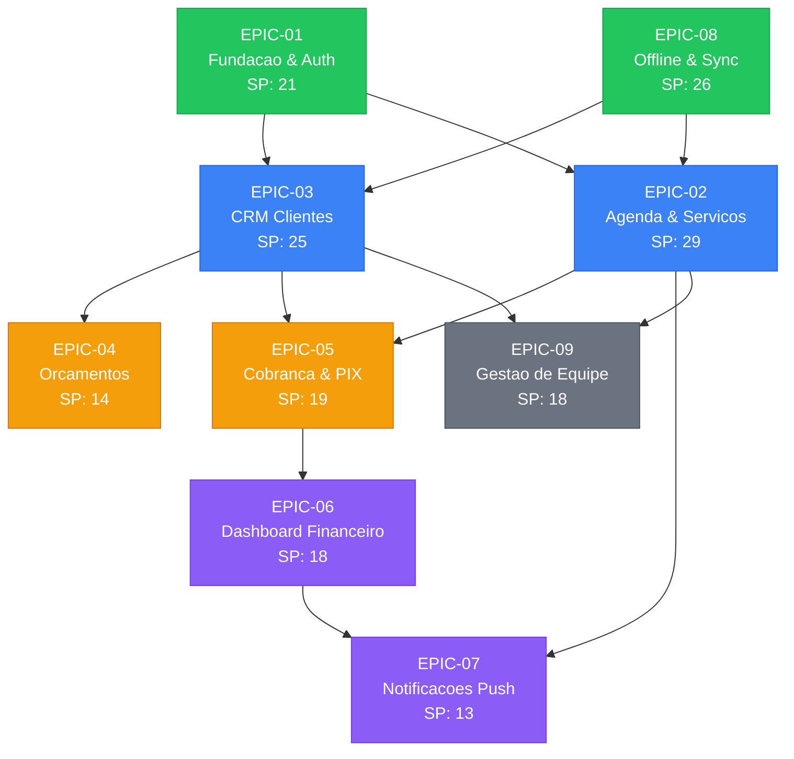

# GardenGreen — Epic Execution Plan

> **Documento:** Epic Execution Plan
> **Versao:** 1.0.0
> **Autor:** @pm-chief (Atlax)
> **Data:** 2026-03-17
> **Status:** Ready for Execution
> **Baseado em:** PRD v0.1.0, Architecture v1.1.0

---

## 1. Visao Geral

**Projeto:** GardenGreen — O app do jardineiro brasileiro
**Total de Epics:** 9
**Total de Stories:** 36
**Total Story Points:** 183 SP
**Timeline estimada:** 16 semanas (MVP) + 4 semanas (Equipe)
**Metodologia:** Scrum (sprints de 2 semanas)

---

## 2. Epic Registry

| Epic ID | Titulo | Prioridade | Stories | SP | Sprint | Dependencias |
|---------|--------|------------|---------|-----|--------|-------------|
| EPIC-01 | Fundacao & Autenticacao | P0 | 4 | 21 | 1-2 | Nenhuma |
| EPIC-08 | Infraestrutura Offline & Sync | P0 | 3 | 26 | 1-2 | Nenhuma |
| EPIC-03 | Gestao de Clientes (CRM) | P0 | 6 | 25 | 3-4 | EPIC-01 |
| EPIC-02 | Agenda & Servicos | P0 | 5 | 29 | 5-6 | EPIC-01 |
| EPIC-04 | Orcamentos | P0 | 4 | 14 | 7-8 | EPIC-03 |
| EPIC-05 | Cobranca & PIX | P0 | 4 | 19 | 9-10 | EPIC-02, EPIC-03 |
| EPIC-06 | Dashboard Financeiro | P0 | 3 | 18 | 11-12 | EPIC-05 |
| EPIC-07 | Notificacoes Push | P0 | 4 | 13 | 11-12 | EPIC-02, EPIC-06 |
| EPIC-09 | Gestao de Equipe (Basico) | P2 | 3 | 18 | 17-20 | EPIC-02, EPIC-03 |

---

## 3. Grafo de Dependencias



**Legenda:** 🟢 Wave 1 (fundacao) | 🔵 Wave 2 (core features) | 🟡 Wave 3 (monetizacao) | 🟣 Wave 4 (retencao) | ⚫ Wave 5 (growth)

---

## 4. Waves de Execucao

### Wave 1: Fundacao (Sprint 1-2) — 47 SP

**Objetivo:** App funcional com auth, database local e sync basico.

| Story ID | Titulo | SP | Epic |
|----------|--------|-----|------|
| 1.1 | Login com Google OAuth | 5 | EPIC-01 |
| 1.2 | Login por Telefone (OTP/SMS) | 5 | EPIC-01 |
| 1.3 | Onboarding Guiado (3 telas) | 8 | EPIC-01 |
| 1.4 | Perfil Progressivo | 3 | EPIC-01 |
| 8.1 | Database Local (WatermelonDB) | 13 | EPIC-08 |
| 8.2 | Sync Automatico | 8 | EPIC-08 |
| 8.3 | Upload de Fotos em Background | 5 | EPIC-08 |

**Criterio de conclusao:** Usuario pode se registrar, completar onboarding, e app funciona offline com sync.

**Riscos:** WatermelonDB sync complexity (mitigacao: sync adapter detalhado na arquitetura).

---

### Wave 2: Core Features (Sprint 3-6) — 54 SP

**Objetivo:** CRM + Agenda funcionais — o jardineiro ja consegue usar o app no dia-a-dia.

#### Sprint 3-4: CRM (EPIC-03) — 25 SP

| Story ID | Titulo | SP | Epic |
|----------|--------|-----|------|
| 3.1 | Cadastrar Cliente (Rapido) | 5 | EPIC-03 |
| 3.2 | Historico de Servicos por Cliente | 5 | EPIC-03 |
| 3.3 | Fotos Antes/Depois | 5 | EPIC-03 |
| 3.4 | Notas de Cliente | 3 | EPIC-03 |
| 3.5 | Busca e Filtro de Clientes | 5 | EPIC-03 |
| 3.6 | Ligar para Cliente (1 Toque) | 2 | EPIC-03 |

#### Sprint 5-6: Agenda (EPIC-02) — 29 SP

| Story ID | Titulo | SP | Epic |
|----------|--------|-----|------|
| 2.1 | Agendar Servico Unico | 8 | EPIC-02 |
| 2.2 | Servicos Recorrentes | 8 | EPIC-02 |
| 2.3 | Calendario Dia e Semana | 5 | EPIC-02 |
| 2.4 | Marcar Servico Concluido | 3 | EPIC-02 |
| 2.5 | Cancelar e Reagendar Servico | 5 | EPIC-02 |

**Criterio de conclusao:** Jardineiro pode cadastrar clientes, agendar servicos, gerenciar agenda completa com recorrencia, tudo offline.

---

### Wave 3: Monetizacao (Sprint 7-10) — 33 SP

**Objetivo:** Orcamentos + Cobranca PIX — o jardineiro ganha dinheiro com o app.

#### Sprint 7-8: Orcamentos (EPIC-04) — 14 SP

| Story ID | Titulo | SP | Epic |
|----------|--------|-----|------|
| 4.1 | Criar Orcamento Rapido | 5 | EPIC-04 |
| 4.2 | Enviar por WhatsApp | 3 | EPIC-04 |
| 4.3 | Converter Orcamento em Servico | 3 | EPIC-04 |
| 4.4 | Gerenciar Status de Orcamento | 3 | EPIC-04 |

#### Sprint 9-10: Cobranca PIX (EPIC-05) — 19 SP

| Story ID | Titulo | SP | Epic |
|----------|--------|-----|------|
| 5.1 | Gerar Cobranca PIX | 8 | EPIC-05 |
| 5.2 | Marcar Pagamento Manual | 3 | EPIC-05 |
| 5.3 | Lembretes de Cobranca | 5 | EPIC-05 |
| 5.4 | Lista de Pendentes | 3 | EPIC-05 |

**Criterio de conclusao:** Jardineiro pode criar orcamentos profissionais, enviar por WhatsApp, cobrar via PIX, e rastrear pagamentos.

**Riscos:** Integracao Asaas API (mitigacao: POC na Fase 1, fallback manual).

---

### Wave 4: Retencao (Sprint 11-12) — 31 SP

**Objetivo:** Dashboard financeiro + Push — o "Aha Moment" que faz o jardineiro voltar todo mes.

| Story ID | Titulo | SP | Epic |
|----------|--------|-----|------|
| 6.1 | Dashboard "Quanto Ganhei" | 5 | EPIC-06 |
| 6.2 | Registro de Despesas | 5 | EPIC-06 |
| 6.3 | Relatorio Mensal Automatico | 8 | EPIC-06 |
| 7.1 | Push Matinal "Seus Clientes de Hoje" | 5 | EPIC-07 |
| 7.2 | Push de Vespera | 3 | EPIC-07 |
| 7.3 | Configuracao de Notificacoes | 3 | EPIC-07 |
| 7.4 | Push de Relatorio Mensal | 2 | EPIC-07 |

**Criterio de conclusao:** Jardineiro ve quanto ganhou, recebe relatorio mensal, e push diario cria habito de uso.

**KPI target:** 60% dos usuarios ativos visualizam o relatorio mensal.

---

### Wave 5: Growth (Sprint 17-20) — 18 SP

**Objetivo:** Plano Equipe — upsell de Solo (R$39) para Equipe (R$99-199).

| Story ID | Titulo | SP | Epic |
|----------|--------|-----|------|
| 9.1 | Convidar Membro | 8 | EPIC-09 |
| 9.2 | Atribuir Servicos | 5 | EPIC-09 |
| 9.3 | Visao Consolidada de Equipe | 5 | EPIC-09 |

**Criterio de conclusao:** Admin pode convidar membros, atribuir servicos, e ver agenda consolidada da equipe.

**Pre-requisito:** MVP lancado (Waves 1-4) + Stripe webhook funcional.

---

## 5. Sprint Allocation

| Sprint | Semanas | Wave | Epics | SP | Velocidade Requerida |
|--------|---------|------|-------|-----|---------------------|
| Sprint 1 | 1-2 | Wave 1 | EPIC-01 (parte) + EPIC-08 (parte) | ~24 | 24 SP/sprint |
| Sprint 2 | 3-4 | Wave 1 | EPIC-01 (resto) + EPIC-08 (resto) | ~23 | 23 SP/sprint |
| Sprint 3 | 5-6 | Wave 2 | EPIC-03 (parte) | ~13 | 13 SP/sprint |
| Sprint 4 | 7-8 | Wave 2 | EPIC-03 (resto) | ~12 | 12 SP/sprint |
| Sprint 5 | 9-10 | Wave 2 | EPIC-02 (parte) | ~16 | 16 SP/sprint |
| Sprint 6 | 11-12 | Wave 2 | EPIC-02 (resto) | ~13 | 13 SP/sprint |
| Sprint 7 | 13-14 | Wave 3 | EPIC-04 | 14 | 14 SP/sprint |
| Sprint 8 | 15-16 | Wave 3 | EPIC-05 (parte) | ~10 | 10 SP/sprint |
| Sprint 9 | 17-18 | Wave 3 | EPIC-05 (resto) | ~9 | 9 SP/sprint |
| Sprint 10 | 19-20 | Wave 4 | EPIC-06 | 18 | 18 SP/sprint |
| Sprint 11 | 21-22 | Wave 4 | EPIC-07 | 13 | 13 SP/sprint |
| Sprint 12 | 23-24 | QA & Release | Testing + Bug fixes | - | - |
| Sprint 13-14 | 25-28 | Wave 5 | EPIC-09 | 18 | 9 SP/sprint |

**Velocidade media estimada:** 15-20 SP/sprint (1 AI dev agent)

---

## 6. Execution Commands

Para iniciar a execucao, o fluxo AIOX e:

```
1. @sm *draft → Cria story detalhada (arquivo .md em docs/stories/)
2. @po *validate-story-draft → Valida story (10-point checklist)
3. @dev *develop → Implementa story
4. @qa *qa-gate → Valida qualidade
5. @devops *push → Push + PR
```

### Ordem de criacao de stories (recomendada):

```
WAVE 1 (fundacao):
  @sm *draft → Story 8.1 (Database Local — base para tudo)
  @sm *draft → Story 1.1 (Login Google)
  @sm *draft → Story 1.2 (Login Telefone)
  @sm *draft → Story 1.3 (Onboarding)
  @sm *draft → Story 8.2 (Sync)
  @sm *draft → Story 1.4 (Perfil Progressivo)
  @sm *draft → Story 8.3 (Upload Fotos Background)

WAVE 2 (core):
  @sm *draft → Stories 3.1 → 3.6 (CRM em sequencia)
  @sm *draft → Stories 2.1 → 2.5 (Agenda em sequencia)

WAVE 3 (monetizacao):
  @sm *draft → Stories 4.1 → 4.4 (Orcamentos)
  @sm *draft → Stories 5.1 → 5.4 (PIX)

WAVE 4 (retencao):
  @sm *draft → Stories 6.1 → 6.3 (Financeiro)
  @sm *draft → Stories 7.1 → 7.4 (Push)

WAVE 5 (growth):
  @sm *draft → Stories 9.1 → 9.3 (Equipe)
```

---

## 7. Quality Gates

### Gate 1: Wave 1 Complete
- [ ] Auth funcional (Google + Phone)
- [ ] Onboarding < 2 min
- [ ] WatermelonDB schema para todas as tabelas
- [ ] Sync pull/push funcional
- [ ] App funciona 100% offline

### Gate 2: Wave 2 Complete
- [ ] CRUD de clientes completo
- [ ] Agenda dia/semana funcional
- [ ] Recorrencia gera instancias
- [ ] Busca de clientes funciona offline
- [ ] Fotos antes/depois capturadas e armazenadas

### Gate 3: Wave 3 Complete
- [ ] Orcamento criado e enviado por WhatsApp
- [ ] PIX gerado via Asaas
- [ ] Webhook de pagamento funcional
- [ ] Fallback para pagamento manual
- [ ] Lista de pendentes funcional

### Gate 4: MVP Ready (Wave 4 Complete)
- [ ] Dashboard financeiro exibe dados reais
- [ ] Relatorio mensal gerado automaticamente
- [ ] Push matinal e vespera funcionais
- [ ] Todas as telas funcionam offline
- [ ] Performance < 3s cold start
- [ ] 0 bugs P0, < 5 bugs P1
- [ ] Testes em 4 devices reais

### Gate 5: Growth Ready (Wave 5 Complete)
- [ ] Convite de membro funcional
- [ ] Atribuicao de servicos funcional
- [ ] RLS de equipe validado
- [ ] Stripe subscription webhook funcional

---

## 8. Riscos de Execucao

| # | Risco | Probabilidade | Impacto | Mitigacao |
|---|-------|--------------|---------|-----------|
| R1 | WatermelonDB sync complexity | Alta | Alto | Sync adapter detalhado na arch, POC no Sprint 1 |
| R2 | Asaas API instabilidade | Media | Alto | Fallback manual, retry com backoff, health check |
| R3 | App Store review rejection | Media | Medio | Seguir guidelines, metadata preparada na Wave 3 |
| R4 | Performance em Android low-end | Media | Alto | Testes em Samsung A10 desde Sprint 1, lazy loading |
| R5 | Custo de SMS para OTP | Baixa | Baixo | Limite de 5 SMS/dia, Google OAuth como alternativa |
| R6 | Scope creep nas stories | Media | Medio | Acceptance criteria rigidos, PO valida antes de dev |

---

*Epic Execution Plan — GardenGreen v1.0.0*
*@pm-chief (Atlax) — 2026-03-17*
*Pronto para execucao via @sm *draft*
